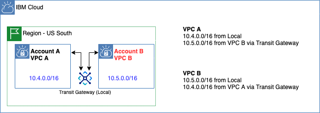
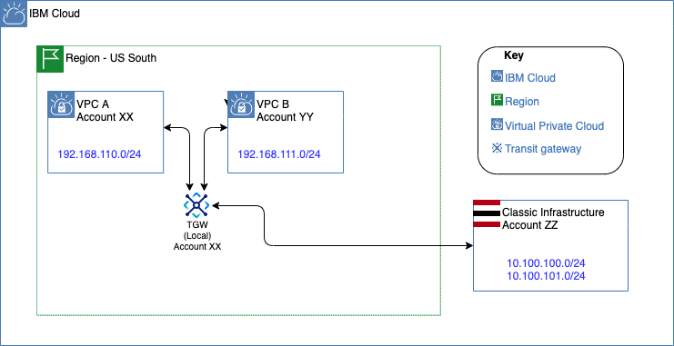
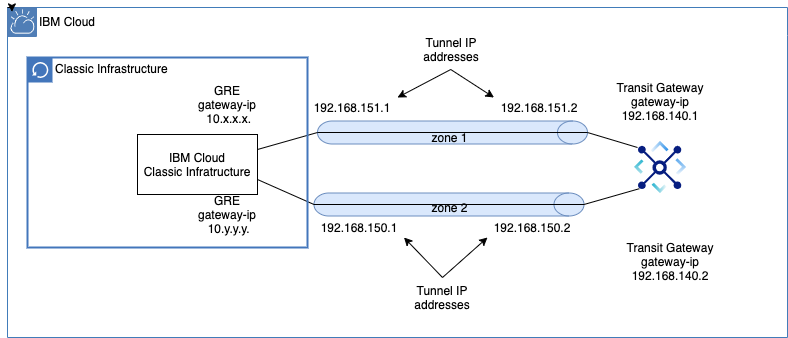
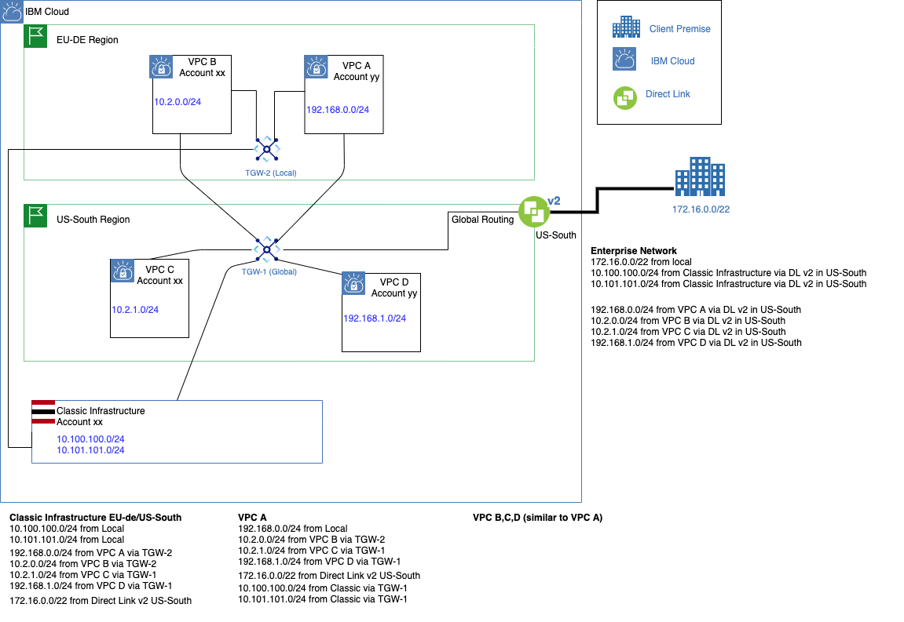

---

copyright:
  years: 2020, 2023
lastupdated: "2023-06-24"

keywords: features, overview

subcollection: transit-gateway

---

{{site.data.keyword.attribute-definition-list}}

# About {{site.data.keyword.tg_full_notm}}
{: #about}

As the number of your Virtual Private Clouds (VPCs) grow, you need an easy way to manage the interconnection between these resources across multiple regions. {{site.data.keyword.tg_full}} is designed specifically for this purpose.
{: shortdesc}

With {{site.data.keyword.tg_full_notm}}, you can create single or multiple transit gateways to connect VPCs together. You can also connect your {{site.data.keyword.cloud_notm}} classic infrastructure to a transit gateway to provide seamless communication with classic infrastructure resources. Any new network that you connect to a transit gateway is then automatically made available to every other network connected to it. This makes it easy to scale your network as it grows.

Transit gateways provide flexibility by allowing you to add networks to local gateways. Networks can be attached to multiple local gateways and a single global gateway, enabling you to keep local traffic on a local gateway.

## Overview of features
{: #feature-overview}

{{site.data.keyword.tg_full_notm}} offers the following features:

### Routing
{: #routing}

{{site.data.keyword.tg_full_notm}} supports local and global routing between VPCs and the {{site.data.keyword.cloud_notm}} classic infrastructure. All routing options remain within the private {{site.data.keyword.cloud_notm}} infrastructure without operating on the public internet, and are optimized for performance. {{site.data.keyword.tg_full_notm}} allows customers greater flexibility, redundancy, and speed in scaling their workloads, as well as in connecting isolated networks running on {{site.data.keyword.cloud_notm}}.

To display the routes report for a transit gateway, see [IBM Cloud Transit Gateway route reports](/docs/transit-gateway?topic=transit-gateway-route-reports) for more information.

### Privacy
{: #privacy}

* Connections to and from an {{site.data.keyword.tg_full_notm}} on the IBM private network are not exposed to the public internet. This reduces public egress and VPN costs as well as reduces security threats.

* {{site.data.keyword.tg_full_notm}} is a fully redundant, fault-tolerant service with no single point of failure within these [{{site.data.keyword.cloud_notm}} Multi-Zone Regions (MZR)](/docs/transit-gateway?topic=transit-gateway-tg-locations).

* {{site.data.keyword.tg_full_notm}} integrates with Identity and Access Management (IAM), letting you manage access to your transit gateway. Using IAM, you can create and manage [{{site.data.keyword.cloud_notm}} users and groups](/docs/transit-gateway?topic=transit-gateway-iam), as well as user permissions to allow or deny their access.

### Easily connect across boundaries
{: #boundaries}

{{site.data.keyword.tg_full_notm}} interconnects your {{site.data.keyword.cloud_notm}} VPCs with compute as well as classic resources across the globe. You can also interconnect VPCs and classic resources across {{site.data.keyword.cloud_notm}} accounts.

{{site.data.keyword.tg_full_notm}} also supports using Generic Routing Encapsulation (GRE) tunnels to connect endpoints. The GRE tunnel connection allows a transit gateway to connect to overlay networks hosted on classic infrastructure resources in unique use cases.

### Direct Link connectivity
{: #directlink}

{{site.data.keyword.tg_full_notm}} supports Direct Link connections. Connecting Direct Link to your {{site.data.keyword.tg_full_notm}} on-premises network grants access to all networks connected on the transit gateway. Similarly, all other connections on the transit gateway will have access to your network. As with other network connections to the {{site.data.keyword.tg_full_notm}}, special consideration must be taken to avoid IP overlap issues. For more information, see [Dealing with overlapping VPC prefixes and classic infrastructure subnets](/docs/transit-gateway?topic=transit-gateway-overlapping-vpc-prefixes-and-classic-subnets).

### {{site.data.keyword.powerSys_notm}} connectivity
{: #powervs}

{{site.data.keyword.tg_full_notm}} supports {{site.data.keyword.powerSys_notm}} connections. Connecting a {{site.data.keyword.powerSys_notm}} instance to your {{site.data.keyword.tg_full_notm}} network grants access to all networks connected on the transit gateway. Similarly, all other connections on the transit gateway will have access to your network. As with other network connections to the {{site.data.keyword.tg_full_notm}}, special consideration must be taken to avoid IP overlap issues. For more information, see [Dealing with overlapping VPC prefixes and classic infrastructure subnets](/docs/transit-gateway?topic=transit-gateway-overlapping-vpc-prefixes-and-classic-subnets).

## Interconnectivity patterns
{: #patterns}

{{site.data.keyword.tg_full_notm}} enables you to connect {{site.data.keyword.cloud_notm}} VPCs and classic infrastructure to transit gateways, allowing you to build global networks of multiple VPCs and classic infrastructure resources across {{site.data.keyword.cloud_notm}} regions to keep up with your business needs. {{site.data.keyword.tg_full_notm}} works across {{site.data.keyword.cloud_notm}} VPCs as well as IBM classic networks.

{{site.data.keyword.tg_full_notm}} can connect to classic networks located in any MZR, regardless of the location of the transit gateway or the routing type specified.
{: note}

Here are some ways that you can implement the {{site.data.keyword.tg_full_notm}} service.

### Use case 1: Interconnect two or more VPCs in the same MZR
{: #use-case-1}

Connect two VPCs in the same region with a local transit gateway.

{: caption="Figure 1. Connect two or more VPCs in the same MZR" caption-side="bottom"}

### Use case 2: Interconnect two or more VPCs across multiple MZRs
{: #use-case-2}

Connect VPCs in multiple regions using a global transit gateway.

{: caption="Figure 2. Connect two or more VPCs across multiple MZRs" caption-side="bottom"}

### Use case 3: Interconnect one or more VPCs in the same MZR and an IBM classic network
{: #use-case-3}

Connect VPCs in the same region with {{site.data.keyword.cloud_notm}} classic through a local transit gateway.

{: caption="Figure 3. Connect to the IBM classic network and one or more VPCs in the same MZR" caption-side="bottom"}

### Use case 4: Interconnect VPCs and an IBM classic network to access all your resources across all MZRs
{: #use-case-4}

Connect VPCs from multiple regions with {{site.data.keyword.cloud_notm}} classic through a global transit gateway.

{: caption="Figure 4. Connect to the IBM classic network and VPCs to access all your resources across all MZRs" caption-side="bottom"}

### Use case 5: Interconnect VPCs across accounts
{: #use-case-5}

Connect VPCs in the same region owned by different {{site.data.keyword.cloud_notm}} accounts through a local transit gateway.

{: caption="Figure 5. Connect two or more VPCs across accounts" caption-side="bottom"}

### Use case 6: Connect networks (VPC and classic) to multiple local gateways
{: #use-case-6}

There are a few things to note about this use case:

- It keeps your local traffic on a local transit gateway, which reduces latency.
- Highly Available (HA) capabilities are provided, as data in VPCs C and D could be replicated in VPCs in E and F.
- Classic infrastructure transit gateway connections are required to be in the same account as the transit gateway owner.

 to multiple gateways"){: caption="Figure 6. Connect networks (VPC and classic) to multiple local gateways" caption-side="bottom"}

### Use case 7: Interconnect networks (VPC and classic) across accounts
{: #use-case-7}

Connect cross-account {{site.data.keyword.cloud_notm}} classic accounts to one or more transit gateways. To do so, the {{site.data.keyword.cloud_notm}} account that owns the transit gateway requests permission from the {{site.data.keyword.cloud_notm}} classic account to connect it to the transit gateway. The {{site.data.keyword.cloud_notm}} classic account must approve the request before the connection is made. You can repeat this process for multiple {{site.data.keyword.cloud_notm}} classic account connections as shown.

{: caption="Figure 7. Connect both VPC and classic across accounts" caption-side="bottom"}

### Use case 8: Connect networks using a High Availability GRE tunnel
{: #use-case-8}

Connect {{site.data.keyword.cloud_notm}} classic infrastructure using a GRE tunnel to a local transit gateway.

This diagram shows a highly available GRE tunnel configuration. When setting up a GRE tunnel configuration, an availability zone must be specified. To make this highly available, you must set up two GRE tunnels with the same endpoints, but using different availability zones.

{: caption="Figure 8. Connect networks using a High Availability GRE tunnel" caption-side="bottom"}

Transit gateway GRE connections require the gateway owner to specifically configure HA for their needs. A GRE connection is a point to point connection, has no built in redundancy, and is a single point of failure. When configuring a GRE connection on a transit gateway, you must specify the availability zone. For a robust HA solution, configure multiple GRE connections using different availability zones.
{: note}

### Use case 9: Connect on-premises network using Direct Link
{: #use-case-9}

Connect {{site.data.keyword.cloud_notm}} Direct Link to allow on-premises connectivity to {{site.data.keyword.cloud_notm}} networks through a transit gateway. This allows the on-premises network to access all networks connected the transit gateway. In the following example, the Direct Link gateway connects to a global transit gateway, along with 4 VPCs and {{site.data.keyword.cloud_notm}} Classic Infrastructure. The inverse is also true, in that all other networks connected to the transit gateway are now connected to the on-premises network.

Direct Link can be connected to either local or remote transit gateways.
{: note}

{: caption="Figure 9. Connect on-premises network using Direct Link" caption-side="bottom"}

### Use case 10: Location connectivity using {{site.data.keyword.powerSys_notm}} and Direct Link Connect
{: #use-case-10}

You can use IBM Cloud Transit Gateway with {{site.data.keyword.powerSys_notm}} and Direct Link Connect for high-bandwidth customer demand. For more information, see [Connecting two {{site.data.keyword.powerSys_notm}} environments by using IBM Cloud Transit Gateway](/docs/power-iaas?topic=power-iaas-network-architecture-diagrams#network-reference-architecture-tgw).
