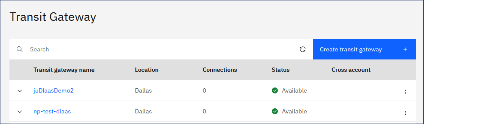
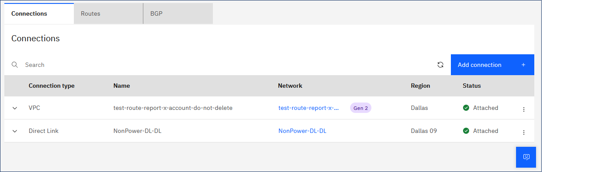
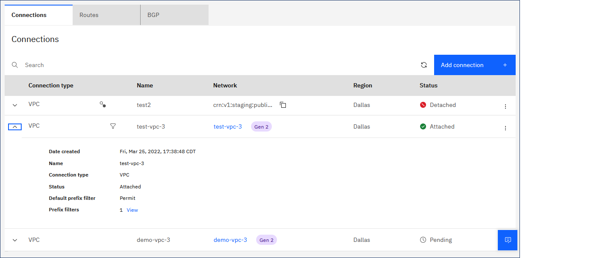
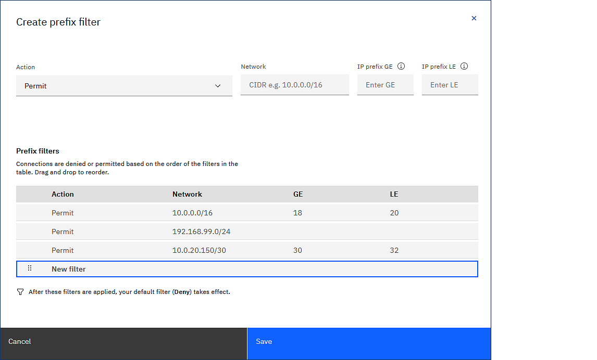
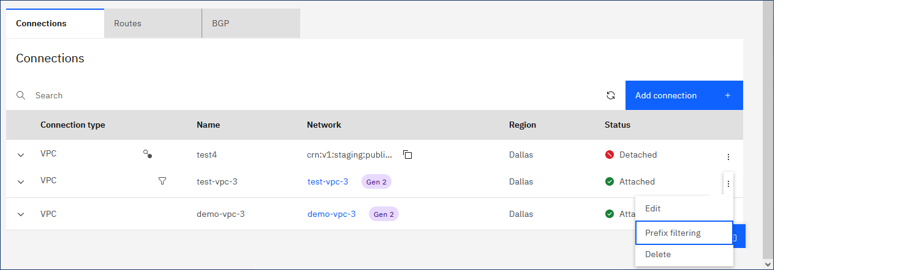
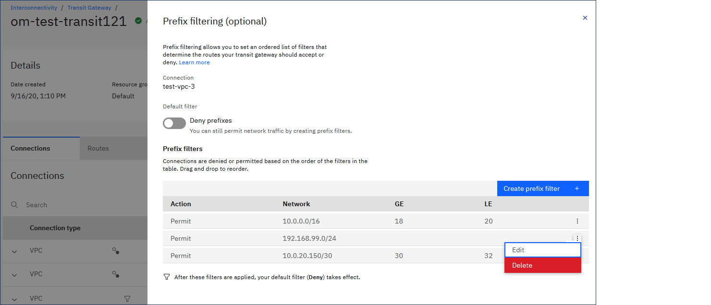
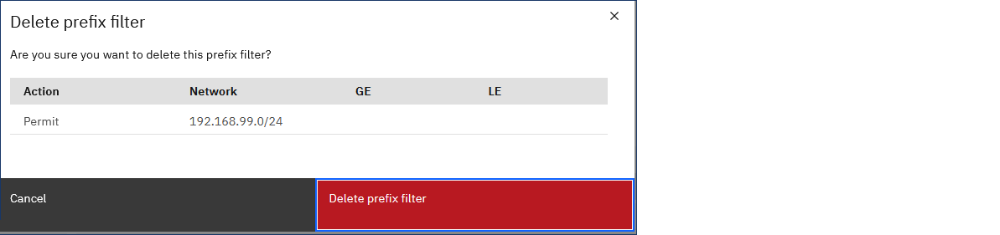

---

copyright:
  years: 2022
lastupdated: "2022-09-12"

keywords: 

subcollection: transit-gateway

---

{{site.data.keyword.attribute-definition-list}}

# Adding and deleting prefix filters
{: #adding-prefix-filters}

Prefix filtering allows you to set an ordered list of prefix route filters for a transit gateway connection.
{: shortdesc}

## Before you begin
{: #adding-prefix-filters-begin}

Make sure that you review the following considerations before creating a prefix filter:

* Only users in the account that contains the network can filter prefixes of that network.
* You cannot filter incoming prefixes from another account.
* Prefix filters in the list are processed sequentially. You can modify the order at any time. 
* Review the [prefix service limits](/docs/transit-gateway?topic=transit-gateway-helpful-tips#service-limits) for transit gateways.
* For cross-account connections, only the account owner of the respective connection can modify prefix filters. Other accounts can view the connection, but cannot modify filters. 
* GRE Tunnel configurations are not implemented as connections. Instead, their routes are learned directly on BGP sessions established over the tunnel. For this reason, prefix filtering is not enabled for these connections.
* If you select **Request connection to a network in another account** as the connect reach option, you cannot set prefix filters because you are not the network owner of the connection. You must set the prefix filter on the account that owns the connection.
* Prefix filter subnet masks are specific. For example, a rule defined as `10.10.20.0/24` does not match with subnet `10.10.20.0/28` or any other subnet prefix.

## Working with prefix filters using the UI
{: #adding-prefix-filters-ui}
{: ui}

You can add prefix filters when you add a new connection. You can also add a filter to an existing connection, or delete them.

### Adding prefix filters to a new connection
{: #adding-prefix-filters-ui-new}

To add a prefix filter to a new connection using the UI, follow these steps:

1. From your browser, open the [{{site.data.keyword.cloud_notm}} console](https://cloud.ibm.com){: external} and log in to your account.
1. Select the Menu icon  from the upper left, then click **Interconnectivity**.
1. Click **Transit Gateway** from the left navigation pane to show the Transit Gateway page.

    {: caption="View your transit gateways" caption-side="bottom"}

1. From the Transit Gateway page, click the name of the the gateway where you want to add prefix filters. 
1. From the gateway's details page, click **Add connection**.

    {: caption="Add a new connection" caption-side="bottom"}

1. Enter the following information:

   Review requirements and configuration considerations in [Planning for Transit Gateway](/docs/transit-gateway?topic=transit-gateway-helpful-tips).
   {: important}

   * Choose a network connection. You can select from the following connection types:

      * **Classic infrastructure** networks allow you to connect to IBM Cloud classic resources. Only one classic infrastructure connection is allowed per account.
      * **VPC** networks can contain compute resources, allowing you to connect to your account's VPC resources, or, with approval, another account's VPC resources.
      * **Direct Link** creates a network connection to and from Direct Link 2.0 gateways so that there is a secure connection to on-premises networks and other resources connected to the transit gateway.

         If you select **Direct Link**, you must also log in to the [Direct Link console](https://cloud.ibm.com/interconnectivity/direct-link){: external} (using the same IBM Cloud account) and specify **Transit Gateway** as the type of network connection for your direct link. You can specify the connection type when you create a direct link, or after your direct link is provisioned. For instructions, see [Updating the network connection type](/docs/dl?topic=dl-virtual-connection-types){: external}.
         {: important}

      * **{{site.data.keyword.powerSys_notm}}** (IBM Internal Use Only) creates a network connection to and from a {{site.data.keyword.powerSys_notm}} instance so that there is a secure connection to networks and other resources connected to the transit gateway.

         If you select **{{site.data.keyword.powerSys_notm}}**, you must also log in to the [??? console](https://cloud.ibm.com/interconnectivity/direct-link){: external} (using the same IBM Cloud account) and specify **Transit Gateway** as the type of network connection for your server. You can specify the connection type when you create a {{site.data.keyword.powerSys_notm}} instance, or after your server is provisioned. For instructions, see [Updating the network connection type](/docs/dl?topic=dl-virtual-connection-types){: external}.
         {: important}
      
   * For Connection reach, select one of the following options:
      * **Add new connection in this account** - Enter an optional connection name.
      * **Request connection to a network in another account** - Enter the IBM Cloud ID of the account that manages the network that you want to connect to, and a connection name. All resources connected to that transit gateway will be accessible from the other network.   
   * Complete all other required information for your connection.

1. Optionally, you can create prefix filters to permit or deny specific routes on specific connections.  

   To begin, expand the drop-down arrow in the upper right of the Prefix filtering section. Then, complete the following information:    

   * Adjust the **Default filter** as needed. Your choices are as follows:

      * **Permit prefixes** (default) accepts all prefixes after entries in the prefix filter list are processed.
      * **Deny prefixes** denies all prefixes after entries in the prefix filter list are processed.
    
      Regardless of the default setting, you can still permit or deny network traffic by creating prefix filters. 
      {: important}
      
   * To create a prefix filter, select **Create prefix filter**, then complete the following information:

      * Select an action type: **Permit** or **Deny**.
      * Enter the network prefix along with its subnet mask (for example, `10.0.0.0/16`).
      * Optionally, enter values for whether the network should be greater than or equal to the subnet mask you chose.    
      * Click **Save** to add the prefix filter.     
       
    Connections are denied or permitted based on the order of the filters in the list. Edit the prefix filter list to adjust the order in which prefixes are processed.      
    {: tip}

1. On the Add connection page, click **Add** to finalize the connection using the prefix filters.

### Adding prefix filters to an existing connection
{: #adding-prefix-filters-ui-new-existing}

To add prefix filtering to an existing connection using the UI, follow these steps:

1. From the Transit Gateway page, click the name of the gateway where you want to add prefix filters.
1. The prefix filtering icon  shows if a connection already has prefix filters. Click **View** next to **Prefix filters** to show the prefix filter list.

    {: caption="View connections with prefix filtering enabled" caption-side="bottom"}

    To modify an existing prefix filter, click the Actions menu  and select **Prefix filtering**.
    {: tip}

1. If the connection does not have existing prefix filters, click the Actions menu  and select **Prefix filtering**.
1. Adjust the default filter as needed. Your choices are as follows:

    * **Permit prefixes** (default) indicates that all prefixes in this connection are accessible to all other connections in this transit gateway. In this case, "all" means up to the established quota and limits.
    * **Deny prefixes** indicates that no prefixes from this connection are accessible to any other connection on this transit gateway.
    
1. Click **Create prefix filter**, then configure the filter with the following options:

    * Select an action.
    * Enter the network prefix along with the subnet mask.
    * Optionally, enter values if the network should be greater than or equal to a desired subnet mask.
    * Adjust the order of the filter in the routing table as needed, then click **Save**.
    
    {: caption="View prefix filtering options" caption-side="bottom"}

### Deleting prefix filters
{: #deleting-prefix-filters-ui}
{: ui}

To delete a prefix filter for an existing connection using the UI, follow these steps:

1. From the details page of the transit gateway, identify the connection where you want to delete prefix filters.

   The prefix filtering icon  shows if a connection already has prefix filters. 
1. Click the connection's Actions menu  and select **Prefix filtering**.

    {: caption="Prefix filtering action" caption-side="bottom"}

1. Click the Actions menu  next to the prefix filter that you want to delete. Then, click **Delete**.

    {: caption="Delete prefix filter" caption-side="bottom"}
	
1. Click **Delete prefix filter** to confirm deletion.

    {: caption="Confirm deletion" caption-side="bottom"}

## Working with prefix filters using the CLI
{: #working-prefix-filters-cli}
{: cli}

You can add prefix filters when you add a new connection using the CLI. You can also delete them.

### Adding prefix filters using the CLI
{: #adding-prefix-filters-cli}

To add prefix filters using the CLI, follow these steps:

```sh
ibmcloud tg prefix-filter-create GATEWAY_ID CONNECTION_ID --prefix PREFIX --action ACTION [--le LE] [--ge GE] [--before BEFORE] [--output json]
```

Where:

- **GATEWAY_ID**: ID of the gateway that the prefix filter is being applied to.

- **CONNECTION_ID**: ID of the connection that the prefix filter is being applied to.

- **--prefix**: Network prefix that the filter will be applied to.

- **--action**: Action to take on the specified prefix (`permit` | `deny`).

- **--le**: Optional: The prefix filter is applied to a subnet mask less than or equal to this value.

- **--ge**: Optional: The prefix filter is applied to a subnet mask greater than or equal to this value.

- **--before**: Optional: Identifier of the prefix filter that this filter should be applied before. If empty, this filter is applied last.

- **--output**: Optional: Specify if you want the output to display in JSON format.

#### Example: Creating a prefix filter
{: #adding-prefix-filters-cli-example}

This is an example of creating a prefix filter using the CLI.

```sh
ibmcloud tg pfc 9f559c43-63f4-4da5-b312-b525a8dce185 6c1bdc19-4adb-4760-8cdc-ef3b74b626f7 --prefix 10.0.250.0/24 --action permit --le 32 --ge 28

FilterID   b4dbe0a6-c52d-4128-cc32-6f53d86bc82b
Prefix     10.0.250.0/24
Action     permit
Ge         28
Le         32
Before
Created    2022-02-28T12:35:09.226-06:00
Updated    2022-02-28T12:35:09.226-06:00
```

#### Deleting prefix filters using the CLI
{: #deleting-prefix-filters-cli}
{: cli}

To delete prefix filters using the CLI, follow these steps:

```sh
ibmcloud tg prefix-filter-delete GATEWAY_ID CONNECTION_ID FILTER_ID [-f, --force]
```

Where:

- **GATEWAY_ID**: ID of the gateway that the prefix filter will be deleted from.

- **CONNECTION_ID**: ID of the connection that the prefix filter will be deleted from.

- **FILTER_ID**: ID of the prefix filter that is being deleted.

- **--force, -f**: Force the deletion operation without confirmation.

#### Example: Deleting a prefix filter
{: #deleting-prefix-filters-cli-example}

This is an example of deleting a prefix filter using the CLI.

```sh
ibmcloud tg pfd 9f559c43-63f4-4da5-b312-b525a8dce185 6c1bdc19-4adb-4760-8cdc-ef3b74b626f7 b4dbe0a6-c52d-4128-cc32-6f53d86bc82b

This deletes filter b4dbe0a6-c52d-4128-cc32-6f53d86bc82b on gateway 9f559c43-63f4-4da5-b312-b525a8dce185 connection 6c1bdc19-4adb-4760-8cdc-ef3b74b626f7 and cannot be undone. Continue [y/N] ?> Y
Deleting filter b4dbe0a6-c52d-4128-cc32-6f53d86bc82b on gateway 9f559c43-63f4-4da5-b312-b525a8dce185 connection 6c1bdc19-4adb-4760-8cdc-ef3b74b626f7 under account bbstsdv1 - IBM as user Hasan.Mahmood.Khan@ibm.com...
OK
Filter b4dbe0a6-c52d-4128-cc32-6f53d86bc82b is deleted.
```

## Working with prefix filters using the API
{: #working-prefix-filters-api}
{: api}

You can add prefix filters when you add a new connection using the API. You can also delete them.

### Adding prefix filters using the API
{: #adding-prefix-filters-api}
{: api}

To add prefix filters using the API, follow these steps:

#### Request
{: #adding-prefix-filters-api-request}

To add prefix filters using the API, adjust the following parameters:

|Path parameters | Details|
|--|--|
|**transit_gateway_id**  \n Required  \n string| The transit gateway identifier|
|**id**  \n Required  \n string| The connection identifier|
{: caption="Table 1. Path parameters for adding prefix filters" caption-side="bottom"}

|Query parameters|Details|
|--|--|
|**version**  \n Required  \n string|Requests the version of the API as of a date in the format `YYYY-MM-DD`. Any date up to the current date can be provided. Specify the current date to request the latest version.  \n **Possible values**: Value must match regular expression `^[0-9]{4}-[0-9]{2}-[0-9]{2}$`|
{: caption="Table 2. Query parameters for adding prefix filters" caption-side="bottom"}

|Request body|Details|
|--|--|
|**action**  \n Required  \n string | Whether to permit or deny prefix filter.  \n **Possible values**: `[permit,deny]`  \n **Example**: `permit`|
|**prefix**  \n Required  \n string | IP prefix and subnet mask  \n **Example**: `192.168.100.0/24`|
|**before**  \n string | Identifier of prefix filter to handle the ordering and follow semantics:  \n - When a filter reference another filter in it's before field, then the filter making the reference is applied before the referenced filter. For example: if filter A references filter B in its before field, A is applied before B.  \n - When a new filter is added that has the same before as an existing filter, then the older filter has its before field updated to point to the new filter. Starting with the above example: if filter C is added and it references B in its before field, then A's before field should be modified to point to C, so the order of application would be A, C and finally B.  \n - A filter that has an empty before reference is applied last (though the date order mentioned still applies). So continuing the preceding examples, if filter B has an empty before field, then it is applied last, but if filter D is created with an empty before field, then B's before field is modified to point to D, so B is applied before D.  \n **Example**: `1a15dcab-7e40-45e1-b7c5-bc690eaa9782`|
|**ge**  \n integer | IP prefix greater than or equal to this number is processed.|
|**le**  \n integer | IP prefix less than or equal to this number is processed.|
{: caption="Table 3. Request body attributes for adding prefix filters" caption-side="bottom"}

#### Example request
{: #adding-prefix-filters-api-request-example}

This example illustrates adding a prefix filter to a connection:

```sh
curl -X POST --location --header "Authorization: Bearer {iam_token}" --header "Accept: application/json" --header "Content-Type: application/json" --data '{ "action": "permit", "prefix": "192.168.100.0/24" }' "{base_url}/transit_gateways/{transit_gateway_id}/connections/{id}/prefix_filters?version={version}"

POST /transit_gateways/{transit_gateway_id}/connections/{id}/prefix_filters
```

```sh
curl -X POST "https://transit.cloud.ibm.com/v1/transit_gateways/9f559c43-63f4-4da5-b306-b525a8ddb275/connections/6c1bdc19-4adb-4550-8cdc-ef3b74b739f8/prefix_filters?version=2020-03-31" -H "Authorization: Bearer $iam_token" -H "Content-Type: application/json" -d '{"action": "deny", "prefix": "10-10.0.10/30"}'
```

#### Response
{: #adding-prefix-filters-api-response}

The following response details show once you initiate the request:

|Response body| Details|
|--|--|
|**action**  \n Always included  \n string | Whether to permit or deny the prefix filter  \n **Possible values**: `[permit,deny]`  \n **Example**: `permit`|
|**created_at**  \n Always included  \n date-time | The date and time that this prefix filter was created |
|**id**  \n Always included  \n string | Prefix filter identified  \n **Example**: `1a15dcab-7e30-45e1-b7c5-bc690eaa9865`|
|**prefix**  \n Always included  \n string | IP prefix and subnet mask  \n **Example**: `192.168.100.0/24`|
|**before**  \n string | Identifier of prefix filter to handle the ordering and follow semantics:  \n - When a filter references another filter in it's before field, then the filter making the reference is applied before the referenced filter. For example: if filter A references filter B in its before field, A is applied before B.  \n - When a new filter is added that has the same before as an existing filter, then the older filter has its before field updated to point to the new filter. Starting with the preceding example, if filter C is added and references B in its before field, then A's before field must be modified to point to C, so the order of application would be A, C and finally B.  \n - A filter that has an empty before reference is applied last (though the date order mentioned still applies). So continuing these examples, if filter B has an empty before field, then it is applied last, but if filter D is created with an empty before field, then B's before field is modified to point to D, so B is applied before D.  \n **Example**: `1a15dcab-7e40-45e1-b7c5-bc690eaa9782`|
|**ge**  \n integer | IP prefix greater than or equal to this number is processed.|
|**le**  \n integer | IP prefix less than or equal to this number is processed.|
|**updated_at**  \n date-time| The date and time that this prefix filter was last updated |
{: caption="Table 4. Response details for adding prefix filters" caption-side="bottom"}

|Status code | Details |
|--|--|
|**201**| The transit gateway connection prefix filters was created successfully.|
|**400**| An invalid prefix filter template was provided. |
|**404**| The specified transit gateway could not be found.|
{: caption="Table 5. Status codes" caption-side="bottom"}

#### Example response
{: #adding-prefix-filters-api-response-example}

This example illustrates the response that a prefix filter was added successfully:

```sh
{
  "action": "permit",
  "before": "1a15dcab-7e40-45e1-b7c5-bc690eaa9782",
  "created_at": "2021-11-15T12:08:05Z",
  "ge": 0,
  "id": "1a15dcab-7e30-45e1-b7c5-bc690eaa9865",
  "le": 32,
  "prefix": "192.168.100.0/24",
  "updated_at": "2021-11-15T12:08:05Z"
}
```

For more information (including Java, Node, Python and Go examples), see "Add a prefix filter to a Transit Gateway Connection" in the [Transit Gateway API reference](/apidocs/transit-gateway#create-transit-gateway-connection-prefix-filter).
{: note}

### Deleting prefix filters using the API
{: #deleting-prefix-filters-api}

To delete prefix filters using the API, follow these steps:

#### Request
{: #deleting-prefix-filters-api-request}

To delete prefix filters using the API, adjust the following parameters:

|Path parameters | Details|
|--|--|
|**transit_gateway_id**  \n Required  \n string| The transit gateway identifier|
|**id**  \n Required  \n string| The connection identifier|
|**filter_id**  \n Required  \n string | The prefix filter identifier|
{: caption="Table 6. Path parameters for deleting prefix filters" caption-side="bottom"}

|Query parameters|Details|
|--|--|
|**version**  \n Required  \n string|Requests the version of the API as of a date in the format `YYYY-MM-DD`. Any date up to the current date may be provided. Specify the current date to request the latest version.  \n **Possible values**: Value must match regular expression `^[0-9]{4}-[0-9]{2}-[0-9]{2}$`|
{: caption="Table 7. Query parameters for deleting prefix filters" caption-side="bottom"}

#### Example request
{: #deleting-prefix-filters-api-request-example}

This example illustrates deleting a prefix filter from a connection:

```sh
curl -X DELETE --location --header "Authorization: Bearer {iam_token}"   "{base_url}/transit_gateways/{transit_gateway_id}/connections/{id}/prefix_filters/{filter_id}?version={version}"
```

```sh
curl -X DELETE "https://transit.cloud.ibm.com/v1/transit_gateways/9f559c43-63f4-4da5-b306-b525a8ddb275/connections/6c1bdc19-4adb-4550-8cdc-ef3b74b739f8/prefix_filters/a4aad53e-5828-4ac1-8dad-a08d940772d4?version=2020-03-31" -H "Authorization: Bearer $iam_token" -H "Content-Type: application/json"
```

#### Response
{: #deleting-prefix-filters-api-response}

The following response details show after you initiate the request:

|Status code| Details |
|--|--|
|**204**|Prefix filter deleted successfully.|
|**404**|Prefix filter with the specified identifier could not be found.|
{: caption="Table 8. Response details for deleting prefix filters" caption-side="bottom"}

#### Example response
{: #deleting-prefix-filters-api-response-example}

This example illustrates the response that a prefix filter with the specified ID could not be found:

```sh
{
  "errors": [
    {
      "code": "not_found",
      "message": "Cannot find Prefix Filter",
      "more_info": "https://cloud.ibm.com/apidocs/transit-gateway#error-handling"
    }
  ],
  "trace": "request_id"
}
```

For more information (including Java, Node, Python and Go examples), see "Remove prefix filter from Transit Gateway Connection" in the [Transit Gateway API reference](/apidocs/transit-gateway#delete-transit-gateway-connection-prefix-filter).
{: note}

## Working with prefix filters using Terraform
{: #working-prefix-filters-terraform}
{: terraform}

Review the following argument references that you can specify for your resource when adding or deleting a prefix filter:

|Argument|Details|
|--|--|
|**gateway**  \n Required \n String | The unique identifier of the gateway. |
|**connection_id**  \n Required  \n String | The unique identifier of the gateway connection.|
|**action**  \n Required  \n String | Whether to permit or deny any matching prefix. |
|**prefix**  \n Required  \n String | The IP prefix. |
|**before**  \n Optional  \n String | The identifier of the prefix filter to place this filter in front of. When a filter references another filter in it's `before` field, then the filter making the reference is applied before the referenced filter.  \n For example, if filter A references filter B in its `before` field, A is applied before B. |
|**ge**  \n Optional  \n Integer | The IP prefix GE. The GE (greater than or equal to) value sets the minimum prefix length on which the filter action is applied. |
|**le**  \n Optional  \n Integer | The IP prefix LE. The LE (less than or equal to) value sets the maximum prefix length on which the filter action is applied. |
{: caption="Table 9. Arguments when adding or deleting a prefix filter using Terraform" caption-side="bottom"}

### Example
{: #working-prefix-filters-terraform-example}

This example shows how to add a prefix filter:

``` sh
resource "ibm_tg_connection_prefix_filter" "test_tg_prefix_filter" {
    gateway = ibm_tg_gateway.new_tg_gw.id
    connection_id = ibm_tg_connection.test_ibm_tg_connection.connection_id
    action = "permit"
    prefix = "192.168.100.0/24"
    le = 32
    ge = 24
}
```

To remove a prefix filter, use the `terraform destroy -target=ibm_tg_connection_prefix_filter.[prefix filter name]` command.
{: tip}
