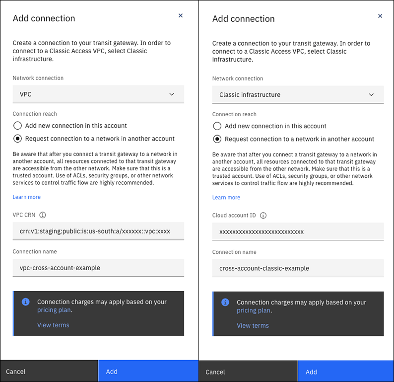
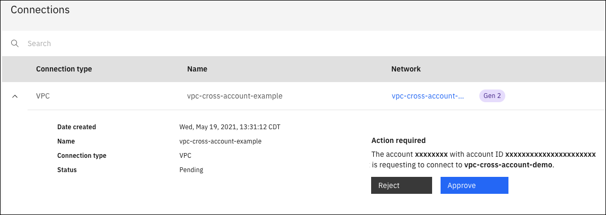
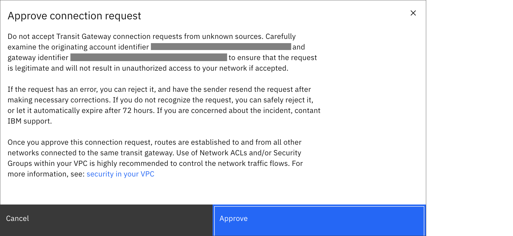

---

copyright:
  years: 2020, 2022
lastupdated: "2022-02-18"

keywords: 

subcollection: transit-gateway

---

{{site.data.keyword.attribute-definition-list}}

# Adding a cross-account connection
{: #adding-cross-account-connections}

You can request connections to networks in other {{site.data.keyword.cloud_notm}} accounts, using the UI, CLI, and API.
{: shortdesc}

Only 10 pending requests are allowed per gateway. To create more requests, you can cancel the pending connection request, or wait for it to be approved. Connection requests expire if not approved within 72 hours.
{: tip}

## Planning considerations
{: #tg-ca-planning}

Be aware that after you connect a transit gateway to a network in another account, all resources connected to that transit gateway are accessible from the other network. Make sure that this is a trusted account. Use of [security controls](/docs/vpc?topic=vpc-security-in-your-vpc), such as ACLs, security groups, or other network services to control traffic flow are highly recommended. Only `VPC` and `Classic` connections are permitted as cross-account connections.

IBM Cloud Transit Gateway does not provide security groups or ACLS, but the networks they attach to may. Security groups and network ACLs can affect transit gateway communications. For more information on ACLs and security groups, refer to the following topics:

* [About network ACLs](/docs/vpc?topic=vpc-using-acls)
* [Security groups versus network ACLs](/docs/vpc?topic=vpc-using-security-groups&interface=ui#security-groups-vs-network-acls)
* [Configuring ACLs and security groups for use with VPN](/docs/vpc?topic=vpc-acls-security-groups-vpn)
* [Configuring ACLs and security groups for use with endpoint gateways](/docs/vpc?topic=vpc-configure-acls-sgs-endpoint-gateways)


## Adding a cross-account connection using the UI
{: #tg-ui-adding-cross-account-connection-transit-gateway}
{: ui}

To connect networks owned by different accounts using the UI, follow these steps:

1. From your browser, open the [{{site.data.keyword.cloud_notm}} console](https://cloud.ibm.com){: external} and log in to your account.
1. Select the Menu icon  from the upper left, then click **Interconnectivity**.
1. Click **Transit Gateway** from the left navigation pane.
1. Click the name of the transit gateway where you want to add a connection and click **Add connection**.
1. Choose your network connection type, either VPC or Classic infrastructure, then select **Request connection to a network in another account**.
1. Type the VPC CRN of the cross-account network, or in the case of classic infrastructure, enter the IBM Cloud account ID that you want to connect to.

   To get the CRN of a VPC, from the {{site.data.keyword.cloud_notm}} console, select the Menu icon  from the upper left, and then click **Resource list**. Expand **VPC Infrastructure** to list your VPCs. Select a VPC and click **Status** to view its details. Copy the CRN and paste it into the Add connection pane.

   To get the IBM Cloud account ID for a classic infrastructure connection, from the {{site.data.keyword.cloud_notm}} console, select **Manage > Account** and choose **Account Settings**. Your account ID shows in the **Account** section of the **Account settings** page.  

1. Type the name of the network connection, then click **Add**. The first screen capture shows adding a VPC connection, the second screen shows adding a classic infrastructure connection.

   {: caption="Figure 1. Add VPC cross account connection" caption-side="bottom"}
   
   In the preceeding image for the classic infrastructure connection, the ID number that is shown is for your IBM Cloud account, not for a SoftLayer account.
   {: note}

   The network connection now shows the **Pending** approval status in the gateway owner's account.

   The network owner's account then receives a notification of the request. If the network owner rejects the cross-account connection, no connectivity is established and the connection shows a status of **Rejected**. You can delete this connection at this point. If the cross-account connection is not explicitly approved, it expires after 72 hours.

   Connection requests can be resubmitted if they expire or are rejected.
   {: note}

1. A user with the [necessary IAM permissions](/docs/transit-gateway?topic=transit-gateway-iam) in the network owner's account can see the gateway and the details of all other connections attached to it in **View only** mode. From the network owner's account, go to the Transit Gateway page and click the gateway name in the table.

1. In the Connections section, see **Action required** to view the incoming network connection request. A user with the [necessary additional IAM permissions](/docs/transit-gateway?topic=transit-gateway-iam) can then click **Approve** to approve the request.

   After the network owner's account ensures that the connection request is from a legitimate source and approves it, the system establishes routes to and from all other networks connected to the same transit gateway. Use of [network ACLs and/or security groups](/docs/vpc?topic=vpc-security-in-your-vpc#security-in-your-vpc) within networks that are accessible across accounts are highly recommended to control the network traffic flows. You can unilaterally detach cross-account connections by either account through users who have the appropriate permissions.
   {: important}

   {: caption="Approve cross-account connection" caption-side="bottom"}

   Click **Approve** to confirm.

   {: caption="Confirm cross-account connection" caption-side="bottom"}

   The status of the network connection indicates **Attaching**.

1. When you change back to the original account, the status of the connection changes to **Attached**, indicating that the network request was approved.

   The gateway owner's account (or the network owner's account) can delete the connection. If the network owner deletes the connection, the gateway owner sees the connection status as **Detached**.
   {: note}

## Adding a cross-account connection using the CLI
{: #tg-cli-adding-cross-account-connection-transit-gateway}
{: cli}

Creating a cross-account connection consists of the following steps:
1. Request connection to communicate between other account
1. Approve/Reject connection on other account

### Connection request
{: #tg-cli-adding-cross-account-connection-transit-gateway-connection-request}

The original account will need to request a connection to communicate with the other account.

#### VPC
{: #tg-cli-adding-cross-account-connection-transit-gateway-connection-request-vpc}

To request a VPC connection to communicate with another account, execute the following command:

```sh
ibmcloud tg connection-create|cc GATEWAY_ID --name NAME --network-type vpc --network-id NETWORK_ID [-h, --help]
```

Where:

- **GATEWAY_ID**: ID of the gateway that the new connection will be on.
- **--name**: Name for the new connection.
- **--network-type**: Network type of the connection.  
- **--network-id**: ID of the network connection. For classic, do not set a value. For VPC, use the CRN. 

To find the CRN of a VPC:

```sh
ibmcloud is vpc VPC_ID --json
```

- **--output json**: Optional: Specify if you want the output to display in JSON format.

- **--help | -h**: Optional: Get help on this command.

For VPC cross-account connections, be sure that the `network-id` is set to the account you are requesting to communicate with.
{: important}

#### Classic
{: #tg-cli-adding-cross-account-connection-transit-gateway-connection-request-cli}

To request a CLI connection to communicate with another account, execute the following command:

```sh
ibmcloud tg connection-create|cc GATEWAY_ID --name NAME --network-type classic --network-account-id NETWORK-ACCOUNT-ID [--output json] [-h, --help]
```

Where:

- **GATEWAY_ID**: ID of the gateway that the new connection will be on.
- **--name**: Name for the new connection.
- **--network-type**: Network type of the connection. Values are `vpc`, `directlink`, or `classic`.
- **--network-account-id**: ID of the IBM Cloud account to use for creating a classic connection. Only used with 'classic' type, when the account of connection is different than the gateway's account.
- **--output json**: Optional: Specify if you want the output to display in JSON format.
- **--help | -h**: Optional: Get help on this command.

For classic connections, be sure that the `network-account-id` is set to the account you are requesting to communicate with.
{: important}

#### Examples
{: #tg-cli-adding-cross-account-connection-transit-gateway-connection-request-examples}

This example illustrates creating a VPC connection named `vpc-connection` using `vpcCRN="crn:v1:bluemix:public:is:us-south:a/3aa0a9999a1a46258064d84f7f447920::vpc:r134-f87014d5-87d2-46d1-9999-24683082f6bc"`:

```sh
ibmcloud tg cc $gateway --name vpc-connection --network-id $vpcCRN --network-type vpc
```
{: pre}

Create a classic connection named `classic-conn`.

```sh
ibmcloud tg cc $gateway --name classic-conn --network-account-id 67123579566843320188712647902101 --network-type classic
```
{: pre}

### Approve a connection
{: #tg-cli-adding-cross-account-connection-transit-gateway-connection-approve}

To approve a connection from another account as the network owner, execute the following command:

```sh
ibmcloud tg connection-approve|ca GATEWAY_ID CONNECTION_ID [-h, --help]
```

Where:

- **GATEWAY_ID**: ID of the gateway the connection is on.
- **CONNECTION_ID**: ID of the connection you are approving.
- **--help | -h**: Optional: Get help on this command.

#### Example
{: #tg-cli-adding-cross-account-connection-transit-gateway-connection-approve-example}

This example illustrates approving a connection from the other account:

```sh
ibmcloud tg ca $gateway $connection
```
{: pre}

### Reject a connection
{: #tg-cli-adding-cross-account-connection-transit-gateway-connection-reject}

To reject a connection from another account as the network owner, execute the following command:

```sh
ibmcloud tg connection-reject|cr GATEWAY_ID CONNECTION_ID [-h, --help]
```

Where:

- **GATEWAY_ID**: ID of the gateway the connection is on.
- **CONNECTION_ID**: ID of the connection you are rejecting.
- **--help | -h**: Optional: Get help on this command.

#### Example
{: #tg-cli-adding-cross-account-connection-transit-gateway-connection-reject-example}

An example of rejecting a connection from the other account

```sh
ibmcloud tg cr $gateway $connection
```
{: pre}

## Adding a cross-account connection using the API
{: #tg-api-adding-cross-account-connection-transit-gateway}
{: api}

To add a cross-account connection, perform the following steps:

1. Request a connection to communicate between other accounts.
1. Perform actions on a requested connection. This must be completed.

For classic cross-account connections, be sure that the `network-account-id` is set to the account you are requesting to communicate with. For VPC cross-account connections, be sure that the `network-id` is set to the account that you are requesting to communicate with. 
{: important}

### Request cross-account connection
{: #request-cross-account-connection}

The original account will need to request a connection to communicate with the other account.

#### Request
{: #tg-api-adding-cross-account-connection-transit-gateway-request}

To request a cross-account connection, set the following parameters:

| Path parameters | Details |
|--|--|
|**transit_gateway_id**  \n Required  \n string | The transit gateway identifier|
{: caption="Table 1. Path parameters for adding a cross-account connection" caption-side="bottom"}

|Query parameters| Details |
|--|--|
|**version**  \n Required  \n string | Requests the version of the API as of a date in the format `YYYY-MM-DD`. Any date up to the current date may be provided. Specify the current date to request the latest version.  \n **Possible values:** Value must match regular expression  `^[0-9]{4}-[0-9]{2}-[0-9]{2}$`|
|**Request Body**  \n Required  \n TransitGatewayConnectionTemplate | The connection template|
|**network_type**  \n Required  \n string | Defines what type of network is connected via this connection.  \n **Allowable values:** [`classic` or `vpc`]  \n **Example:** `vpc`|
|**name**  \n Name|The user-defined name for this transit gateway connection. Network type `vpc` connections are defaulted to the name of the VPC. Network type `classic` connections are named 'Classic'.  \n **Possible values:** `1 ≤ length ≤ 63`, Value must match regular expression  `^([a-zA-Z]-[a-zA-Z][-_a-zA-Z0-9]*[a-zA-Z0-9])$`  \n **Example:** `Transit_Service_BWTN_SJ_DL`|
|**network_account_id**  \n AccountID|The ID of the account which owns the network that is being connected. Generally only used if the network is in a different account than the gateway.  \n This field is used when gateway connection is in network type `classic`.  \n This field is required to be unspecified for network type `gre_tunnel`.  \n **Example:** `28e4d90ac7504be694471ee66e70d0d5`|
|**network_id**  \n string | The ID of the network being connected via this connection. This field is required for `vpc`. This is the target CRN for network type `vpc`  \n This field is required to be unspecified for network type `classic`, `gre_tunnel`, and `unbound_gre_tunnel` connections.  \n **Example:** `crn:v1:bluemix:public:is:us-south:a/123456::vpc:4727d842-f94f-4a2d-824a-9bc9b02c523b`|
{: caption="Table 2. Query parameters for adding a cross-account connection" caption-side="bottom"}

##### Example request
{: #tg-api-adding-cross-account-connection-transit-gateway-request-example}

This example illustrates the original account requesting a cross-account connection:

```sh
curl -X POST --location --header "Authorization: Bearer {iam_token}" \
  --header "Accept: application/json" \
  --header "Content-Type: application/json" \
  --data '{ "network_type": "vpc" }'   
  "
{base_url}/transit_gateways/{transit_gateway_id}/connections?version={version}"
```

```sh
  "name": "Transit_Service_BWTN_SJ_DL",
  "network_id": "crn:v1:bluemix:public:is:us-south:a/123456::vpc:4727d842-f94f-4a2d-824a-9bc9b02c523b",
  "network_type": "vpc",
  "prefix_filters": [
    {
      "action": "permit",
      "ge": 0,
      "le": 32,
      "prefix": "192.168.100.0/24"
    }
  ],
  "prefix_filters_default": "permit",
```
  
#### Response
{: #tg-api-adding-cross-account-connection-transit-gateway-response}

The following response details show once you initiate the request:

| Response Body | Details |
|--|--|
|**name**  \n Always included*  \n Name|The user-defined name for this transit gateway connection.  \n **Possible values:** `1 ≤ length ≤ 63`, Value must match regular expression  `^([a-zA-Z]-[a-zA-Z][-_a-zA-Z0-9]*[a-zA-Z0-9])$`.  \n **Example:** `Transit_Service_BWTN_SJ_DL`|
|**network_type**  \n Always included*  \n string|Defines what type of network is connected via this connection. The list of enumerated values for this property may expand in the future. Code and processes using this field must tolerate unexpected values.  \n **Possible values:** [`classic` or `vpc`]  \n **Example:** `vpc`|
|**id**  \n Always included*  \n string | The unique identifier for this Transit Gateway Connection  \n **Example:** `1a15dca5-7e33-45e1-b7c5-bc690e569531`|
|**created_at** \n Always included*  \n date-time|The date and time that this connection was created|
|**network_id**  \n string|The ID of the network being connected via this connection. This field is required for some types, such as `vpc`.  \n This is the target CRN for network type `vpc`  \n **Example:** `crn:v1:bluemix:public:is:us-south:a/123456::vpc:4727d842-f94f-4a2d-824a-9bc9b02c523b`|
|**network_account_id**  \n AccountID|The ID of the account which owns the connected network. Generally only used if the network is in a different IBM Cloud account than the gateway.  \n This value is used for network type `classic`.  \n **Example:** `28e4d90ac7504be694471ee66e70d0d5`|
|**request_status**  \n string|Only visible for cross account connections, this field represents the status of a connection request between IBM Cloud accounts. The list of enumerated values for this property may expand in the future. Code and processes using this field must tolerate unexpected values.  \n **Possible values:** [`pending`,`approved`,`rejected`,`expired`,`detached`]|
|**status**  \n string|Connection's current configuration state. The list of enumerated values for this property may expand in the future. Code and processes using this field must tolerate unexpected values.  \n **Possible values:** [`attached`,`failed`,`pending`,`deleting`,`detaching`,`detached`]|
|**updated_at**  \n date-time|The date and time that this connection was last updated|
{: caption="Table 3. Initiate request response" caption-side="bottom"}

|Status code||
|--|--|
|**201**|The transit gateway connection was created successfully.|
|**400**|An invalid connection template was provided.|
|**404**|The specified Transit Gateway could not be found, the specified resource group could not be found, or the default resource group could not be found (if the resource group was not specified in the template).|
|**409**|The network being connected must either be in a location that is considered "local" to the specified Transit Gateway, or the specified Transit Gateway needs to be global. The network being connected cannot already be connected to another Transit Gateway.|
{: caption="Table 4. Status codes" caption-side="bottom"}

##### Example response
{: #tg-api-adding-cross-account-connection-transit-gateway-response-example}

This example illustrates the response from a request for a cross-account connection:

```sh
{
  "created_at": "2020-03-31T12:08:05Z",
  "id": "1a15dca5-7e33-45e1-b7c5-bc690e569531",
  "name": "example-connection",
  "network_id": "crn:[...]",
  "network_type": "vpc",
  "status": "pending",
  "updated_at": "2020-03-31T12:08:05Z"
}
```

### Perform actions on a requested connection
{: #tg-api-adding-cross-account-connection-transit-gateway-actions}

After the original account has requested a cross-account connection, the other account must perform actions on a requested connection.

#### Request 
{: #tg-api-adding-cross-account-connection-transit-gateway-actions-request}

To perform actions on a requested cross-account connection, set the following parameters:

|Query parameters|Details|
|--|--|
|**version**  \n Required  \n string|Requests the version of the API as of a date in the format `YYYY-MM-DD`. Any date up to the current date may be provided. Specify the current date to request the latest version.  \n **Possible values:** Value must match regular expression  `^[0-9]{4}-[0-9]{2}-[0-9]{2}$`|
|**Request Body**  \n Required  \n TransitGatewayConnectionActions | The action template|
|**action**  \n Required  \n string| The action that is to be performed against the connection request  \n **Allowable values:** [`approve`,`reject`]  \n **Example:** `approve`|
{: caption="Table 5. Query parameters for requesting a cross-account connection" caption-side="bottom"}

##### Example request
{: #tg-api-adding-cross-account-connection-transit-gateway-actions-request-example}

This example illustrates approving a cross-account connection:

```sh
"
{base_url}/transit_gateways/{transit_gateway_id}/connections/{id}/actions?version={version}"
{
  "action": "approve"
}

```

#### Response
{: #tg-api-adding-cross-account-connection-transit-gateway-actions-response}

The following response results show once you initiate the request:

|Status code||
|--|--|
|**204**|The connection approval/rejection was successful.|
|**403**|The caller is not authorized to perform the requested action, or the action was called by the gateway owning account.|
|**404**|  A transit gateway or transit gateway connection with the specified identifier could not be found.|
|**409**|Attempted to approve a classic_access VPC connection.|
{: caption="Table 6. Status codes" caption-side="bottom"}

##### Example response
{: #tg-api-adding-cross-account-connection-transit-gateway-actions-response-example}

This example illustrates a Status 403 response in which the caller is not authorized to perform the requested action:

```sh
{
  "errors": [
    {
      "code": "missing_field",
      "message": "The `location` field is required.",
      "more_info": "https://transitservice.cloud.ibm.com/",
      "target": {
        "name": "location",
        "type": "field"
      }
    }
  ],
  "trace": "86780a34-e651-4b47-9fb0-184a169cc9af"
}
```

For more information (including Java, Node, Python and Go examples), see "Add Connection to a Transit Gateway" and "Perform actions on a connection for a Transit Gateway" in the [Transit Gateway API reference](apidocs/transit-gateway?code=java#create-transit-gateway-connection).
{: note}
