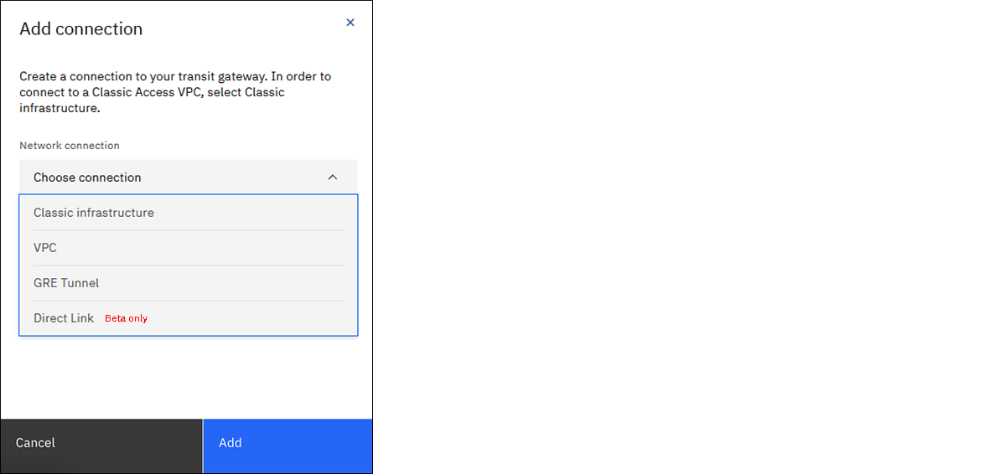

---

copyright:
  years: 2020, 2021
lastupdated: "2021-07-29"

keywords: editing, managing, manage, edit, add, connection

subcollection: transit-gateway

---

{:shortdesc: .shortdesc}
{:new_window: target="_blank"}
{:codeblock: .codeblock}
{:pre: .pre}
{:screen: .screen}
{:tip: .tip}
{:note: .note}
{:beta: .beta}
{:important: .important}
{:download: .download}
{:external: target="_blank" .external}
{:term: .term}

# Adding a connection
{: #adding-connections}

To add a connection to a transit gateway, follow these steps:
1. From your browser, open the [{{site.data.keyword.cloud_notm}} console](https://cloud.ibm.com){:external} and log in to your account.
1. Select the Menu icon  from the upper left, then click **Interconnectivity**.
1. Click **Transit Gateway** from the left navigation pane.
1. Click the name of the transit gateway where you want to add a connection.

  If you are in the expanded view, click **View details**.
  {: tip}

1. Click **Add connection**.

1. Choose and configure the specific network connections that you want to add to your transit gateway.

   

   Choices include:

   * **Classic infrastructure** - Allows you to connect to IBM Cloud classic resources.
   * **VPC** - Allows you to connect to your account's VPC resources, or VPC resources from other accounts as well.
   * **GRE tunnel** - Allows a transit gateway to connect to overlay networks hosted on classic infrastructure resources in approved use cases. For prerequisites and detailed instructions, see [Creating a Generic Routing Encapsulation (GRE) tunnel connection](/docs/transit-gateway?topic=transit-gateway-GRE-connection).
   * **Direct Link** (Beta) - Creates a network connection to and from Direct Link 2.0 gateways so that there is a secure connection to on-premises networks and other resources connected to the transit gateway.   

      If you select **Direct Link**, you must also log in to the [Direct Link console](https://cloud.ibm.com/interconnectivity/direct-link){: external} (using the same IBM Cloud account) and specify **Transit Gateway** as the type of network connection for your direct link. You can specify the connection type when you create a direct link, or after your direct link is provisioned. For instructions, see [Updating the network connection type](/docs/dl?topic=dl-virtual-connection-types){: external}.
      {: important}

      The **Direct Link** choice is a Beta feature that requires special approval. The use of this functionality should not be for production workloads. If you are interested in participating in this Beta, you can either open a Sev 4 support case and request access or contact your IBM Sales representative.
      {: beta}

1. Click **Add** to create a connection.
