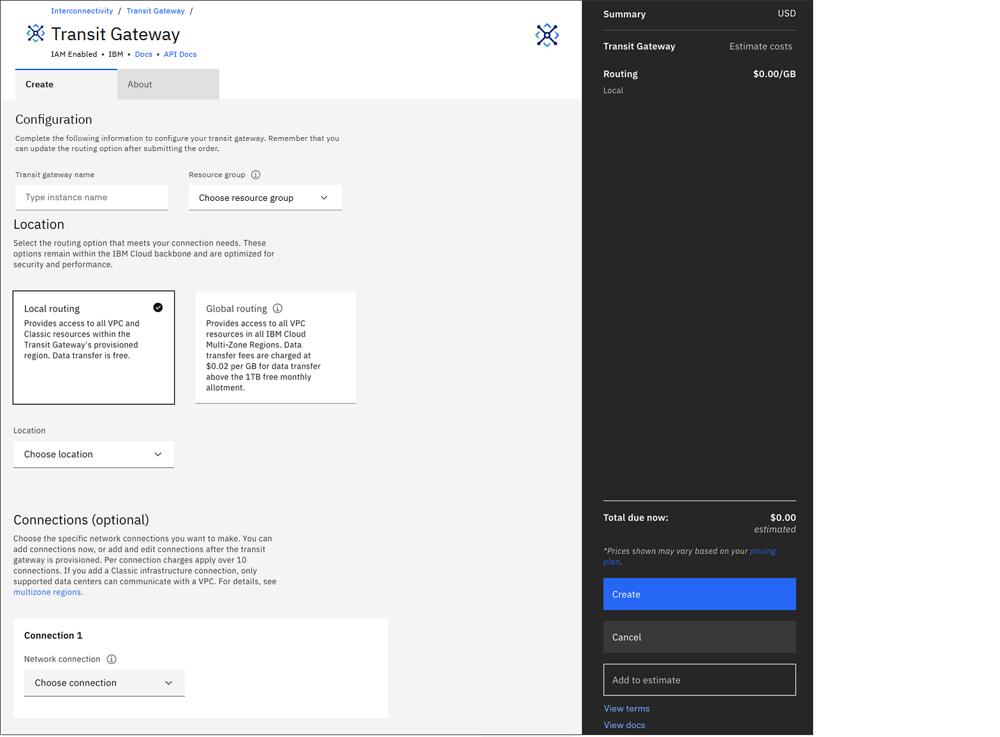

---

copyright:
  years: 2020, 2021
lastupdated: "2021-07-29"

keywords: connecting, vpc, region, order

subcollection: transit-gateway

---

{{site.data.keyword.attribute-definition-list}}

# Ordering IBM Cloud Transit Gateway
{: #ordering-transit-gateway}
{: help}
{: support}

To get started using {{site.data.keyword.tg_full_notm}}, follow these steps:
{: shortdesc}

1. Review requirements and configuration considerations in [Planning for Transit Gateway](/docs/transit-gateway?topic=transit-gateway-helpful-tips).
2. From your browser, open the [{{site.data.keyword.cloud_notm}} catalog](https://cloud.ibm.com/catalog){: external} and log in to your account.
3. Select **Networking** in the navigation pane, then click the Transit Gateway tile.

   You can also access the ordering page from the [{{site.data.keyword.cloud_notm}} console](https://cloud.ibm.com){: external} by selecting the Menu icon  on the upper left of the page. Then select **Interconnectivity** > **Transit Gateway** and click the **Create Transit Gateway** button.
   {: tip}

   The ordering page displays.

   {: caption="Transit gateway ordering page" caption-side="bottom"}

4. From the ordering page, enter a name for the transit gateway and select a resource group. You can select a resource group from the list, or keep the default selection.

5. Choose a routing option:

   * Select **Local routing** if you want your transit gateway to only connect VPCs in the same [Multi-Zone Region (MZR)](/docs/overview?topic=overview-locations#mzr-table).
   * Select **Global routing** if you want your transit gateway to connect to VPCs in different regions.

   You can upgrade routing options at a later point if your needs change. Pricing is changed accordingly.
   {: note}

   Remember that all of your classic resources across MZRs can be accessed regardless of routing choice.
   {: tip}

6. Select the location to provision your transit gateway in. If you are using local routing, the location chosen will limit you to connect VPCs located in that region only. If you are using global routing, the location chosen will affect the price for data transfer, so chose the region closest to the resources you need connected.

7. You can add connections to your transit gateway now or after it has been provisioned.

   To add them now, select the network connection to be attached to the transit gateway, and then type a name for the connection. To add multiple network connections to the transit gateway, click **Add connection**.

   To add them later, refer to [Adding a connection](/docs/transit-gateway?topic=transit-gateway-edit-gateway#adding-connections). Cross account (VPC only) connections can only be added later, after you provision the gateway.

   You can add the following connection types to your gateway:

   * **Classic infrastructure** networks allow you to connect to IBM Cloud classic resources. Only one classic infrastructure connection is allowed per account.
   * **VPC** networks can contain compute resources, allowing you to connect to your account's VPC resources, or, with approval, another account's VPC resources.
   * **Direct Link** creates a network connection to and from Direct Link 2.0 gateways so that there is a secure connection to on-premises networks and other resources connected to the transit gateway.

      If you select **Direct Link**, you must also log in to the [Direct Link console](https://cloud.ibm.com/interconnectivity/direct-link){: external} (using the same IBM Cloud account) and specify **Transit Gateway** as the type of network connection for your direct link. You can specify the connection type when you create a direct link, or after your direct link is provisioned. For instructions, see [Updating the network connection type](/docs/dl?topic=dl-virtual-connection-types){: external}.
      {: important}

   Once added, all prefixes of a VPC and all subnets of a classic network will be connected to the transit gateway. To ensure successful connectivity between VPCs, when creating VPCs that are intended to be interconnected using a transit gateway, make sure to create the VPCs with non-overlapping VPC prefixes. To ensure successful connectivity with the classic infrastructure, do not use prefixes in your VPCs that overlap with the `10.0.0.0/14`, `10.200.0.0/14`, `10.198.0.0/15`, and `10.254.0.0/16` blocks. Also, don't use addresses from your classic infrastructure subnets. To view a list of your classic infrastructure subnets, see [View all subnets](/docs/subnets?topic=subnets-view-all-subnets).

8. **View Terms** on the right of the page.
9. Click **Create** to complete your order.
