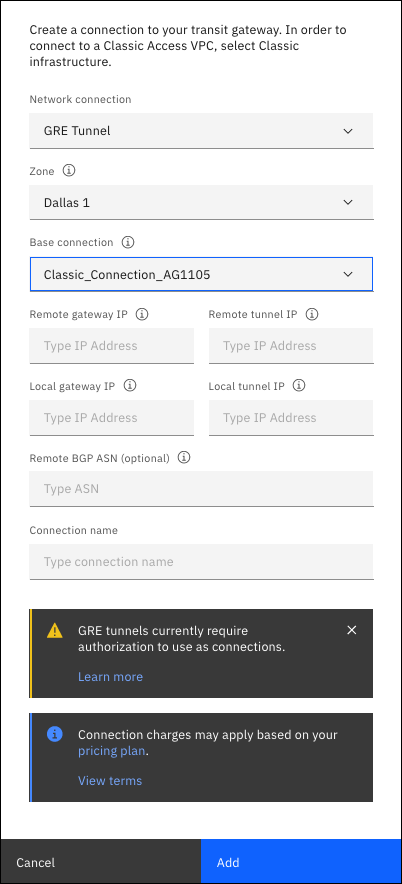

---

copyright:
  years: 2020, 2021
lastupdated: "2021-06-17"

keywords: editing, managing, manage, edit, add, connection

subcollection: transit-gateway

---

{{site.data.keyword.attribute-definition-list}}

# Creating a Generic Routing Encapsulation (GRE) tunnel connection
{: #GRE-connection}

You can use a GRE tunnel transit gateway connection to connect endpoints. This connection allows a transit gateway to connect to overlay networks hosted on classic infrastructure resources in approved use cases.
{: shortdesc}

## Before you begin
{: #GRE-begin}

The following prerequisites must be met before you can create a GRE tunnel connection:

* The use of GRE tunnels is restricted to IBM-approved use cases only. [Create a support case](/docs/get-support?topic=get-support-open-case) to discuss and get approval for your specific use case.
* Ensure that you have an existing classic infrastructure connection, or create one. For more information, see [Adding a connection](/docs/transit-gateway?topic=transit-gateway-adding-connections). The GRE tunnel connection connects with an endpoint only on classic infrastructure.
* Review the [Generic Routing Encapsulation (GRE) connection considerations](/docs/transit-gateway?topic=transit-gateway-helpful-tips#gre-considerations) for additional prerequisites.

## Creating a GRE tunnel connection
{: #creating-gre}

To create your GRE tunnel connection, follow these steps:

1. From your browser, open the [{{site.data.keyword.cloud_notm}} console](https://cloud.ibm.com){: external} and log in to your account.
1. Select the Menu icon  from the upper left, then click **Interconnectivity**.
1. Click **Transit Gateway** from the left navigation panel. Click the name of the transit gateway where you want to add a connection.

   If you are in the expanded view, click **View details**.
   {: tip}

1. Click **Add connection**.
1. Choose **GRE tunnel** as your network connection type.
1. Choose an availability zone in which to create the tunnel, then select the base connection (which must be a classic infrastructure connection).
1. Configure the remaining parameters for the connection:
   * Enter the remote gateway IP[^ip1] for the endpoint of the GRE tunnel.
   * Enter a `/30` remote tunnel IP[^ip2] for both ends of the tunnel, for example `192.168.103.2`.
   * Enter the local gateway IP address that the transit gateway uses to host the underlay network for the GRE tunnel.

      This IP address must not conflict with any networks connected to your transit gateway.
      {: note}

   * Enter a `/30` local tunnel IP[^ip3] for both ends of the tunnel, for example `192.168.103.1`.
   * Optionally, enter the remote BGP ASN, which is a valid 2 or 4 byte value of your choosing.

      You can leave this blank and a unique ASN is assigned.
      {: tip}
      
   * Enter a connection name for your GRE tunnel.

1. Click the **Add** button to create the GRE tunnel.

   {: caption="Creating GRE tunnel connections" caption-side="bottom"}

## Next step
{: #tgw-next-step-gre}

To configure the other end of the BGP tunnel, expand the newly created GRE tunnel in the Connections panel to see its details. It will show the Local BGP ASN. If you created an optional remote BGP ASN, it also shows in the Connections panel. You must give this ASN information to the person creating the other end of the BGP tunnel, so that the BGP session can be fully configured.

[^ip1]: This address must comply with rfc1918 IP addresses and cannot be in conflict with any existing networks connected to the transit gateway.

[^ip2]: This address must comply with rfc1918 IP addresses and cannot be in conflict with any existing networks connected to the transit gateway.

[^ip3]: This address must comply with rfc1918 IP addresses and cannot be in conflict with any existing networks connected to the transit gateway.
