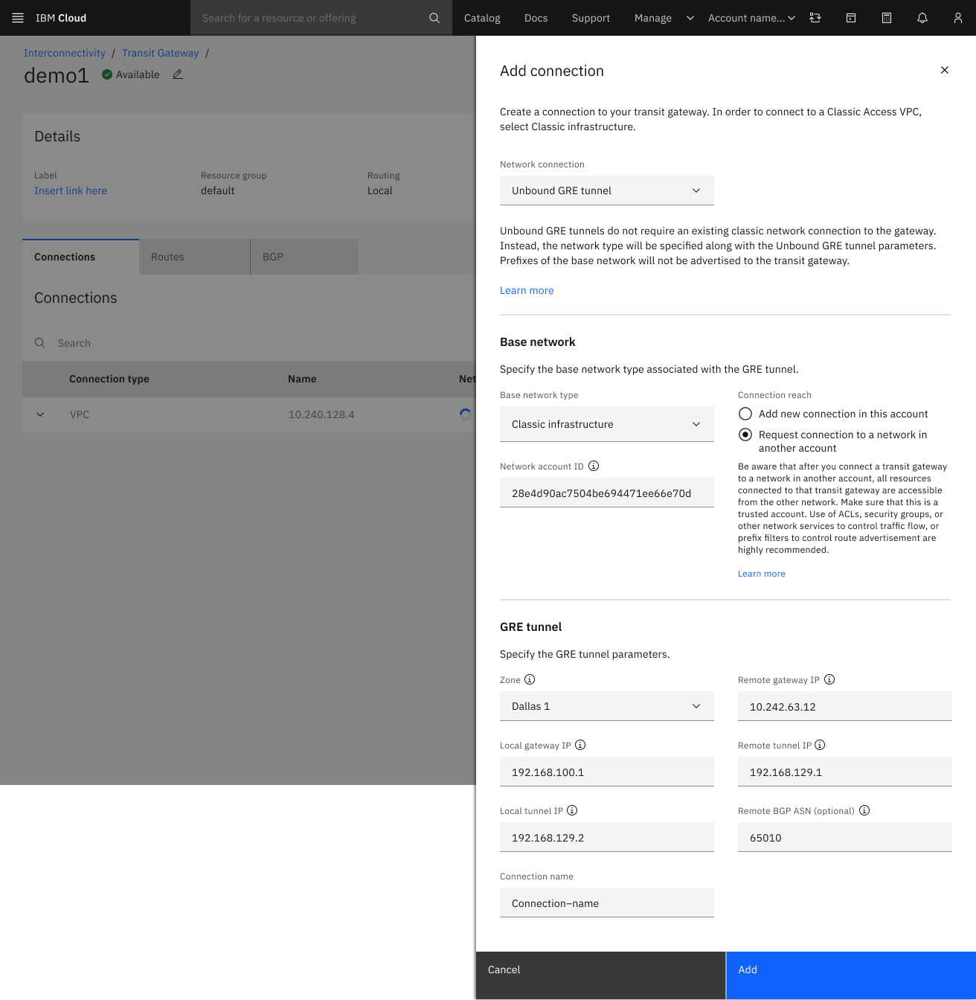
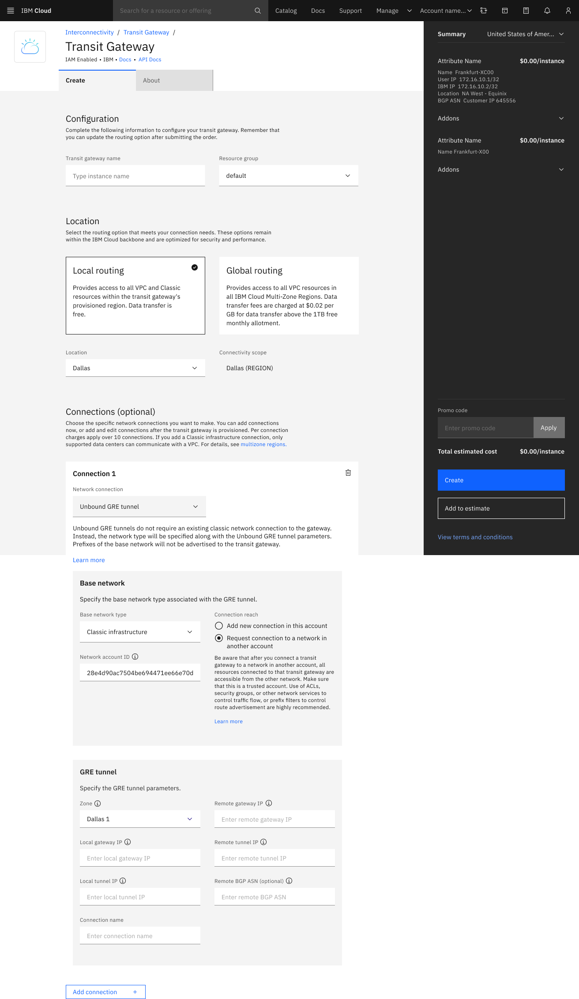

---

copyright:
  years: 2020, 2022
lastupdated: "2022-08-31"

keywords: editing, managing, manage, edit, add, connection

subcollection: transit-gateway

---

{{site.data.keyword.attribute-definition-list}}

# Creating an unbound Generic Routing Encapsulation tunnel connection
{: #unbound-gre-connection}

You can use an unbound Generic Routing Encapsulation (GRE) tunnel transit gateway connection to connect endpoints. This connection allows a transit gateway to connect to overlay networks hosted on classic infrastructure resources.

{: shortdesc}

Unbound transit gateway GRE connections require the gateway owner to specifically configure HA for their needs. A GRE connection is a point-to-point connection, has no built in redundancy, and is a single point of failure. When configuring an unbound GRE connection on a transit gateway, you must specify the availability zone. For a robust HA solution, configure multiple GRE connections using different availability zones.
{: note}

## Creating an unbound GRE tunnel connection using the UI
{: #tg-ui-adding-unbound-gre-connection-transit-gateway}
{: ui}

### Before you begin
{: #unbound-GRE-begin}

Before creating an unbound GRE tunnel connection, review
[Generic Routing Encapsulation connection considerations](/docs/transit-gateway?topic=transit-gateway-helpful-tips#gre-considerations)
for additional prerequisites.

### Creating an unbound GRE tunnel connection on an existing transit gateway
{: #creating-unbound-gre-existing-tg}

To create your unbound GRE tunnel on an existing transit gateway, follow these steps:

1. From your browser, open the [{{site.data.keyword.cloud_notm}} console](https://cloud.ibm.com){: external} and log in to your account.
1. Select the Menu icon  from the upper left, then click **Interconnectivity**.
1. Click **Transit Gateway** from the left navigation panel. Click the name of the transit gateway where you want to add a connection.

   If you are in the expanded view, click **View details**.
   {: tip}

1. Click **Add connection** in the Connections tab.
1. Choose **Unbound GRE tunnel** as your network connection type.
1. Select the base network type and whether this is a connection to a network in another account.
1. If this connection is to a network in another account, enter the account id.
1. Choose an availability zone in which to create the tunnel.
1. Configure the remaining parameters for the connection:
   * Enter the remote gateway IP[^ip1] for the endpoint of the GRE tunnel.
   * Enter a `/30` remote tunnel IP[^ip2] for both ends of the tunnel, for example `192.168.103.2`.
   * Enter the local gateway IP address[^ip3] that the transit gateway uses to host the underlay network for the GRE tunnel. This user-selected IP address is configured on the transit gateway GRE tunnel after the tunnel is created.
   * Enter a `/30` local tunnel IP[^ip4] for both ends of the tunnel, for example `192.168.103.1`.
   * Optionally, enter the remote BGP ASN, which is a valid 2 or 4 byte value of your choosing.

      You can leave this blank and a unique ASN is assigned.
      {: tip}
      
   * Enter a connection name for your GRE tunnel.

1. Click the **Add** button to create the GRE tunnel.

   {: caption="Creating unbound GRE tunnel connections" caption-side="bottom"}
   
### Creating an unbound GRE tunnel connection while creating a new transit gateway
{: #creating-unbound-gre-new-tg}
   
To create your unbound GRE tunnel connection while creating a new transit gateway, follow these steps:

1. From your browser, open the [{{site.data.keyword.cloud_notm}} console](https://cloud.ibm.com){: external} and log in to your account.
1. Select the Menu icon  from the upper left, then click **Interconnectivity**.
1. Click **Transit Gateway** from the left navigation panel. Click **Create transit gateway**.
1. Enter the transit gateway name, resource group, and location.
1. Choose **Unbound GRE tunnel** as your network connection type for the connection to create.
1. Select the base network type and whether this is a connection to a network in another account.
1. If this connection is to a network in another account, enter the account id.
1. Choose an availability zone in which to create the tunnel.
1. Configure the remaining parameters for the connection:
   * Enter the remote gateway IP[^ip5] for the endpoint of the GRE tunnel.
   * Enter a `/30` remote tunnel IP[^ip6] for both ends of the tunnel, for example `192.168.103.2`.
   * Enter the local gateway IP address[^ip7] that the transit gateway uses to host the underlay network for the GRE tunnel. This user-selected IP address is configured on the transit gateway GRE tunnel after the tunnel is created.
   * Enter a `/30` local tunnel IP[^ip8] for both ends of the tunnel, for example `192.168.103.1`.
   * Optionally, enter the remote BGP ASN, which is a valid 2 or 4 byte value of your choosing.

      You can leave this blank and a unique ASN is assigned.
      {: tip}
      
   * Enter a connection name for your GRE tunnel.

1. Click the **Add connection** button to add the unbound GRE tunnel to the transit gateway.

   {: caption="Creating Unbound GRE tunnel connections during gateway provision" caption-side="bottom"}

1. Once all connections have been added, press the **Create** button to create the transit gateway with the network connections.

### Next steps
{: #tgw-next-step-unbound-gre}

To configure the other end of the BGP tunnel, expand the newly created unbound GRE tunnel in the Connections panel to see its details. It will show the Local BGP ASN. If you created an optional remote BGP ASN, it also shows in the Connections panel. You must give this ASN information to the person creating the other end of the BGP tunnel, so that the BGP session can be fully configured.

[^ip1]: This address must comply with rfc1918 IP addresses and cannot be in conflict with any existing networks connected to the transit gateway.

[^ip2]: This address must comply with rfc1918 IP addresses and cannot be in conflict with any existing networks connected to the transit gateway.

[^ip3]: This address must not be an IP address within the multicast range of `224.0.0.0` to `239.255.255.255` and cannot be in conflict with any existing networks connected to the transit gateway.

[^ip4]: This address must comply with rfc1918 IP addresses and cannot be in conflict with any existing networks connected to the transit gateway.

[^ip5]: This address must comply with rfc1918 IP addresses and cannot be in conflict with any existing networks connected to the transit gateway.

[^ip6]: This address must comply with rfc1918 IP addresses and cannot be in conflict with any existing networks connected to the transit gateway.

[^ip7]: This address must not be an IP address within the multicast range of `224.0.0.0` to `239.255.255.255` and cannot be in conflict with any existing networks connected to the transit gateway.

[^ip8]: This address must comply with rfc1918 IP addresses and cannot be in conflict with any existing networks connected to the transit gateway.

## Creating an unbound Generic Routing Encapsulation tunnel connection using the CLI
{: #tg-cli-adding-unbound-gre-connection-transit-gateway}
{: cli}

Create an unbound Generic Routing Encapsulation (GRE) tunnel connection on a given transit gateway.

```sh
ibmcloud tg connection-create-gre|ccgre GATEWAY_ID --name NAME --zone ZONE --local-gateway-ip LOCAL_GATEWAY_IP --local-tunnel-ip LOCAL_TUNNEL_IP --remote-gateway-ip REMOTE_GATEWAY_IP --remote-tunnel-ip REMOTE_TUNNEL_IP [--network-type NETWORK_TYPE] [--base-connection-id BASE_CONNECTION_ID] [--base-network-type BASE_NETWORK_TYPE] [--network-account-id NETWORK_ACCOUNT_ID] [--remote-bgp-asn REMOTE_BGP_ASN] [--output json]
```
{: pre}

Where:

- **GATEWAY_ID**: ID of the gateway where the new connection is bound.

- **--name**: Name of the new connection.

- **--zone**: Availability zone for the GRE tunnel. Example: `us-south-1`

- **--local-gateway-ip**: Local gateway IP address for the GRE tunnel connection.

- **--local-tunnel-ip**: Local tunnel IP address for the GRE tunnel connection.

- **--remote-gateway-ip**: Remote gateway IP address for the GRE tunnel connection.

- **--local-tunnel-ip**: Remote tunnel IP address for the GRE tunnel connection.

- **--network-type**: Optional: The type of GRE tunnel to create, either `gre_tunnel` or `unbound_gre_tunnel`. The default is `gre_tunnel`.

- **--base-connection-id**: Optional: The ID of the classic network connection that will be the underlay for the GRE tunnel. Used only for `gre_tunnel` type connections.

- **--base-network-type**: Optional: The type of network the GRE tunnel is targeting (classic). Used only for `unbound_gre_tunnel` type connections. 

- **--network-account-id**: Optional: The ID of the IBM Cloud account to use for creating a cross account GRE tunnel to a classic network. Used only for `unbound_gre_tunnel` type connections.

- **--remote-bgp-asn**: Optional: If the remote BGP ASN is not specified, one is generated.

- **--output json**: Optional: Shows the output in JSON format.

- **--help | -h**: Optional: Get help on this command.

### Example
{: #connection-create-unbound-gre-examples}

This example illustrates creating an unbound GRE tunnel connection named `unbound-gre-connection` to a classic network:

```sh
ibmcloud tg connection-create-gre $gateway  --network-type unbound_gre_tunnel --name unbound-gre-connection --base-network-type classic  --zone us-south-2 --local-gateway-ip 192.168.100.1 --local-tunnel-ip 192.168.101.1 --remote-gateway-ip 10.242.63.12 --remote-tunnel-ip 192.168.101.2
```
{: pre}

## Creating an unbound Generic Routing Encapsulation (GRE) tunnel connection using the API
{: #tg-api-adding-unbound-gre-connection-transit-gateway}
{: api}

To create an unbound Generic Routing Encapsulation (GRE) tunnel connection using the API, perform the following actions:

### Request
{: #add-unbound-gre-connection-curl-api-request}

To request a creation of an Unbound Generic Routing Encapsulation (GRE) tunnel connection, set the following parameters:

| Path parameters | Details |
|--|--|
|**transit_gateway_id**  \n Required  \n string | The transit gateway identifier|
{: caption="Table 1. Path parameters for creating a GRE" caption-side="bottom"}

|Query parameters| Details |
|--|--|
|**version**  \n Required  \n string | Requests the version of the API as of a date in the format `YYYY-MM-DD`. Any date up to the current date may be provided. Specify the current date to request the latest version.  \n **Possible values:** Value must match the regular expression:  `^[0-9]{4}-[0-9]{2}-[0-9]{2}$`|
|**Request Body**  \n Required  \n TransitGatewayConnectionTemplate | The connection template. |
|**network_type**  \n Required  \n string | Defines what type of network is connected using this connection.  \n For access to `unbound_gre_tunnel` connections, contact IBM support.  \n **Allowable value:** `[unbound_gre_tunnel]`  \n **Example:** `unbound_gre_tunnel`|
|**base_network_type**  \n Required  \n string | Defines what type of network the GRE tunnel is targeting. This field is required for and only applicable to type `unbound_gre_tunnel` connections.  \n **Allowable value:** `[classic]`  \n **Example:** `classic`|
|**local_gateway_ip**  \n string | Local gateway IP address. This field is required for, and only applicable to, `gre_tunnel` and `unbound_gre_tunnel` type connections.  \n **Example:** `192.168.100.1`|
|**local_tunnel_ip**  \n string|Local tunnel IP address. This field is required for, and only applicable to, `gre_tunnel` and `unbound_gre_tunnel` type connections. The `local_tunnel_ip` and `remote_tunnel_ip` addresses must be in the same `/30` network. Neither can be the network nor the broadcast addresses.  \n **Example:** `192.168.129.2` |
|**name**  \n Name | The user-defined name for this transit gateway connection.  \n Name specification is required for network type `gre_tunnel` and `unbound_gre_tunnel` connections.  \n **Possible values:** 1 ≤ length ≤ 63, value must match the regular expression: `^([a-zA-Z]|[a-zA-Z][-_a-zA-Z0-9]*[a-zA-Z0-9])$`  \n **Example:** `Transit_Service_BWTN_SJ_DL`|
|**remote_bgp_asn**  \n string | Remote network BGP ASN. This field is only applicable to `gre_tunnel` and `unbound_gre_tunnel` type connections. The following ASN values are reserved and unavailable: `64512-64513, 65100, 65201-65234, 65402-65433, 65500` and `4201065000-4201065999`. If `remote_bgp_asn` is omitted on `gre_tunnel` connection create requests, IBM will assign an ASN.  \n **Example:** `65010`|
|**remote_gateway_ip**  \n string | Remote gateway IP address. This field is required for, and only applicable to type `gre_tunnel` and `unbound_gre_tunnel` connections.  \n **Example:** `10.242.63.12`|
|**remote_tunnel_ip**  \n string|Remote tunnel IP address. This field is required for and only applicable to, `gre_tunnel` and `unbound_gre_tunnel` type connections. The `local_tunnel_ip` and `remote_tunnel_ip` addresses must be in the same `/30` network. Neither can be the network nor broadcast addresses.  \n **Example:** `192.168.129.1` |
|**zone**  \n ZoneIdentityByName | For network_type `gre_tunnel` and `unbound_gre_tunnel` connections specify the connection's location. The specified availability zone must reside in the gateway's region. Use the IBM Cloud global catalog to list zones within the desired region. This field is required for and only applicable to `gre_tunnel` and `unbound_gre_tunnel` type connections.|
|- **name**  \n string|Availability zone name.  \n **Example:** `us-south-1`|
{: caption="Table 2. Query parameters for creating a GRE" caption-side="bottom"}

#### Example request
{: #add-unbound-gre-connection-curl-api-request-example}

This example illustrates requesting a GRE connection:

```sh
curl -X POST "https://transit.cloud.ibm.com/v1/transit_gateways/test/connections?version=2022-01-27" -H "accept: application/json" -H "Content-Type: application/json" -d "{\"local_gateway_ip\":\"192.168.100.1\",\"local_tunnel_ip\":\"192.168.129.2\",\"name\":\"Transit_Service_BWTN_SJ_DL\",\"network_type\":\"unbound_gre_tunnel\",\"base_network_type\":\"classic\",\"remote_bgp_asn\":65010,\"remote_gateway_ip\":\"10.242.63.12\",\"remote_tunnel_ip\":\"192.168.129.1\",\"zone\":{\"name\":\"us-south-1\"}}"

{
  "local_gateway_ip": "192.168.100.1",
  "local_tunnel_ip": "192.168.129.2",
  "name": "Transit_Service_BWTN_SJ_DL",
  "network_type": "unbound_gre_tunnel",
  "base_network_type": "classic",
  "remote_bgp_asn": 65010,
  "remote_gateway_ip": "10.242.63.12",
  "remote_tunnel_ip": "192.168.129.1",
  "zone": {
    "name": "us-south-1"
  }
}
```
{: pre}

### Response
{: #add-unbound-gre-connection-curl-api-response}

The following response results show once you initiate the request:

| Response body | Details |
|--|--|
|**name**  \n Always included*  \n Name | The user-defined name for this transit gateway connection.  \n **Possible values:** 1 ≤ length ≤ 63, Value must match thr regular expression: `^([a-zA-Z]|[a-zA-Z][-_a-zA-Z0-9]*[a-zA-Z0-9])$`  \n **Example:** `Transit_Service_BWTN_SJ_DL`|
|**network_type**  \n Always included*  \n string | Defines what type of network is connected through this connection. The list of enumerated values for this property may expand in the future. Code and processes using this field must tolerate unexpected values.  \n **Possible values:** [`unbound_gre_tunnel`]  \n **Example:** `unbound_gre_tunnel`|
|**id**  \n Always included*  \n string | The unique identifier for this transit gateway connection  \n **Example:** `1a15dca5-7e33-45e1-b7c5-bc690e569531`|
|**created_at** \n Always included*  \n date-time | The date and time that this connection was created. |
|**base_network_type**  \n string | Defines what type of network the GRE tunnel is targeting. This field only applies to `unbound_gre_tunnel` type connections. The list of enumerated values for this property may expand in the future. Code and processes using this field must tolerate unexpected values.  \n **Possible values:** [`classic`]  \n **Example:** `classic`|
|**local_bgp_asn**  \n integer | The local network BGP ASN. This field only applies to network type `gre_tunnel` and `unbound_gre_tunnel` connections.  \n **Example:** `64490`|
|**local_gateway_ip**  \n string| The local gateway IP address. This field only applies to network type `gre_tunnel` and `unbound_gre_tunnel` connections.  \n **Example:** `192.168.100.1`|
|**local_tunnel_ip** \n string| The local tunnel IP address. This field only applies to network type `gre_tunnel` and `unbound_gre_tunnel` connections.  \n **Example:** `192.168.129.2`|
|**mtu**  \n integer|The GRE tunnel MTU. This field only applies to network type `gre_tunnel` and `unbound_gre_tunnel` connections.  \n **Example:** `9000`|
|**remote_bgp_asn**  \n integer | The remote network BGP ASN. This field only applies to network type `gre_tunnel` and `unbound_gre_tunnel` connections.  \n **Example:** `65010`|
|**remote_gateway_ip**  \n string | The remote gateway IP address. This field only applies to `gre_tunnel` and `unbound_gre_tunnel` type connections.  \n **Example:** `10.242.63.12`|
|**remote_tunnel_ip**  \n string | The remote tunnel IP address. This field only applies to `gre_tunnel` and `unbound_gre_tunnel` type connections.  \n **Example:** `192.168.129.1`|
|**request_status**  \n string | Represents the status of a connection request between IBM Cloud accounts, and is only visible for cross account connections. The list of enumerated values for this property may expand in the future. Code and processes using this field must tolerate unexpected values.  \n **Possible values:** [`pending`,`approved`,`rejected`,`expired`,`detached`]|
|**status**  \n string | The connection's current configuration state. The list of enumerated values for this property may expand in the future. Code and processes using this field must tolerate unexpected values.  \n **Possible values:** [`attached`,`failed`,`pending`,`deleting`,`detaching`,`detached`]|
|**updated_at**  \n date-time | The date and time that this connection was last updated. |
|**zone**  \n ZoneReference | The location of GRE tunnel. This field only applies to `gre_tunnel` and `unbound_gre_tunnel` type connections.|
|- **name**  \n Always included*  \n string | Availability zone name  \n **Example:** `us-south-1`|
{: caption="Table 3. Initating request response" caption-side="bottom"}

|Status Code||
|--|--|
|**201**|The transit gateway connection was created successfully.|
|**400**|An invalid connection template was provided.|
|**404**|The specified transit gateway could not be found, the specified resource group could not be found, or the default resource group could not be found (if the resource group was not specified in the template).|
|**409**|The network being connected must either be in a location that is considered "local" to the specified transit gateway, or the specified transit gateway must be global. The network being connected cannot already be connected to another transit gateway.|
{: caption="Table 4. Status codes" caption-side="bottom"}

#### Example response
{: #add-unbound-gre-connection-curl-api-response-example}

This example illustrates the response from creating an unbound GRE tunnel:

```sh
{
  "created_at": "2020-03-31T12:08:05Z",
  "id": "1a15dca5-7e33-45e1-b7c5-bc690e569531",
  "name": "example-connection",
  "network_type": "unbound_gre_tunnel",
  "base_network_type": "classic",
  "status": "pending",
  "updated_at": "2020-03-31T12:08:05Z"
}
```
{: screen}

For more information (including Java, Node, Python and Go examples), refer to [Add Connection to a Transit Gateway(/apidocs/transit-gateway#create-transit-gateway-connection).
{: note}

## Creating a Generic Routing Encapsulation tunnel connection using Terraform
{: #tg-terraform-adding-unbound-gre-connection-transit-gateway}
{: terraform}

You can specify the following argument references for your resource when creating an unbound Generic Routing Encapsulation (GRE) tunnel connection:

|Argument|Details|
|--|--|
|**gateway**  \n Required  \n Forces new resource  \n string|Enter the transit gateway identifier.|
|**local_gateway_ip**  \n Optional  \n Forces new resource  \n string | The local gateway IP address.  \n This field is required for, and only applicable to, `gre_tunnel` and `unbound_gre_tunnel` type connections|
|**local_tunnel_ip**  \n Optional  \n Forces new resource  \n string|The local tunnel IP address.  \n This field is required fo,r and only applicable to, `gre_tunnel` and `unbound_gre_tunnel` type connections.|
|**name**  \n Optional  \n string | The name of the connection. If the name is not given, the default name is provided based on the network type, such as `unbound_gre_tunnel` for network type unbound gre.|
|**network_type**  \n Required  \n Forces new resource  \n string | The network type. Allowed values are `gre_tunnel` and `unbound_gre_tunnel`
|**base_network_type**  \n Optional  \n Forces new resource  \n string| The base network type. Allowed values are `classic`.  \n This field only applies to `unbound_gre_tunnel` type connections.
|**remote_bgp_asn**  \n Optional  \n Forces new resource  \n integer | The remote network BGP ASN. It will be generated for the connection if not specified.  \n This field only applies to `gre_tunnel` and `unbound_gre_tunnel` type connections.|
|**remote_gateway_ip**  \n Optional  \n Forces new resource  \n string | The remote gateway IP address. This field only applies to `gre_tunnel` and `unbound_gre_tunnel` type connections.|
|**remote_tunnel_ip**  \n Optional  \n Forces new resource  \n string | The remote tunnel IP address. This field only applies to `gre_tunnel` and `unbound_gre_tunnel` type connections.|
|**zone**  \n Optional  \n Forces new resource  \n string | The location of the GRE tunnel. This field only applies to `gre_tunnel` and `unbound_gre_tunnel` type connections.|
{: caption="Table 5. Terraform argument references for creating a GRE" caption-side="bottom"}

### Example
{: #tg-terraform-adding-unbound-gre-connection-transit-gateway-example}

This example illustrates requesting an unbound GRE tunnel connection:

```sh
resource "ibm_tg_connection" "test_ibm_tg_connection" {
  gateway            = ibm_tg_gateway.test_tg_gateway.id
  network_type       = "unbound_gre_tunnel"
  base_network_type  = "classic"
  name               = "myconnection"
  local_gateway_ip   = 192.168.0.1
  local_tunnel_ip    = 10.0.0.1
  remote_bgp_asn     = 36361
  remote_gateway_ip  = 192.168.1.1
  remote_tunnel_ip   = 10.0.1.1
  zone               = us-east
}
```
{: pre}
