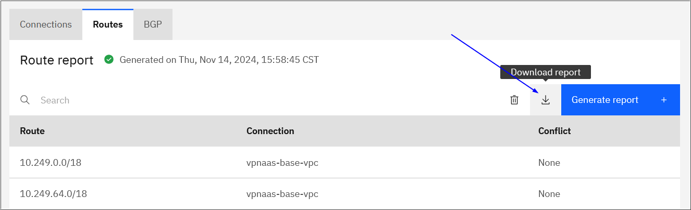

---

copyright:
  years: 2024
lastupdated: "2024-11-15"

keywords: Transit Gateway

subcollection: transit-gateway

---

{{site.data.keyword.attribute-definition-list}}

# Understanding data portability for Transit Gateway
{: #data-portability}

[Data portability](#x2113280){: term} involves a set of tools and procedures that enable customers to export the digital artifacts that are needed to implement similar workload and data processing on different service providers or on-premises software. It includes procedures for copying and storing the service customer content, including the related configuration that is used by the service to store and process the data, on the customer's own location.
{: shortdesc}

## Responsibilities
{: #data-portability-responsibilities}

{{site.data.keyword.cloud_notm}} services provide interfaces and instructions to guide the customer to copy and store the service customer content, including the related configuration, on their own selected location.

The customer is responsible for the use of the exported data and configuration for data portability to other infrastructures, which includes:

- The planning and execution for setting up alternative infrastructure on different cloud providers or on-premises software that provide similar capabilities to the {{site.data.keyword.IBM_notm}} services.
- The planning and execution for the porting of the required application code on the alternative infrastructure, including the adaptation of customer's application code, deployment automation, and so on.
- The conversion of the exported data and configuration to the format that's required by the alternative infrastructure and adapted applications.

To find out more about responsibility ownership for using {{site.data.keyword.cloud}} products between {{site.data.keyword.IBM_notm}} and customer see [Understanding your responsibilities when using Transit Gateway](/docs/transit-gateway?topic=transit-gateway-tg-responsibilities).

## Data export procedures
{: #data-portability-procedures}

Customer content is not stored. Only the metadata regarding the configuration of the transit gateways ordered by the customer is retained, exactly as specified by the customer. There is no need for the customer to export this metadata.
{: important}

### Exporting route report data from the UI
{: #export-route-report-data}

You can [generate a report](/docs/transit-gateway?topic=transit-gateway-route-reports&interface=ui) that lists all the routes known to a transit gateway and its associated connections. This route report also includes Border Gateway Protocol (BGP) details, such as which connections provide which routes and any overlapping routes.

When creating a route report from a transit gateway's details page, you can download the data using the Download icon.

{: caption="Downloading route report data using the UI" caption-side="bottom"}

### Exporting transit gateway data with the CLI and API
{: #transit-gateway-export-cli-api}

The following table provides mechanisms to export the settings and configurations that are used to process the customer's content through the means of the IBM Cloud Transit Gateway [CLI](/docs/transit-gateway?topic=transit-gateway-transit-gateway-cli) and [API](/apidocs/transit-gateway). The procedures given in the linked documentation should be followed and the output stored to ensure all necessary configuration data is available.

| CLI  | API |
|--------------------|-------------------------|
| [ibmcloud tg gateways](/docs/transit-gateway?topic=transit-gateway-transit-gateway-cli#list-gateways) \n [ibmcloud tg connections](/docs/transit-gateway?topic=transit-gateway-transit-gateway-cli#list-connections) \n [ibmcloud tg locations](/docs/transit-gateway?topic=transit-gateway-transit-gateway-cli&interface=ui#list-locations) \n [ibmcloud tg route-reports](/docs/transit-gateway?topic=transit-gateway-transit-gateway-cli#list-routereports)| [list transit gateways](/apidocs/transit-gateway#list-transit-gateways) \n [list connections](/apidocs/transit-gateway#list-connections) \n [list gateway locations](/apidocs/transit-gateway#list-gateway-locations) \n [list transit gateway route reports](/apidocs/transit-gateway#list-transit-gateway-route-reports)|
{: caption="Exporting transit gateway data with the CLI and API" caption-side="bottom"}

## Exported data formats
{: #data-portability-data-formats}

Transit Gateway supports the following data format and schema of the exported data, configuration, and application:

* Export in JSON format only

Example command using the CLI, [ibmcloud tg gateways](/docs/transit-gateway?topic=transit-gateway-transit-gateway-cli#list-gateways):

```sh
ibmcloud tg gateways|gws [--output json] [-h, --help]
```
{: pre}

Example request using the API, [list-transit-gateways](/apidocs/transit-gateway#list-transit-gateways):

```sh
curl -X GET --location --header "Authorization: Bearer {iam_token}" --header "Accept: application/json" "{base_url}/transit_gateways?version={version}"
```
{: codeblock}

## Data ownership
{: #data-portability-ownership}

All exported data is classified as customer content. Apply the full customer ownership and licensing rights, as stated in the [IBM Cloud Service Agreement](https://www.ibm.com/support/customer/csol/terms/?id=Z126-6304_WS){: external}.
