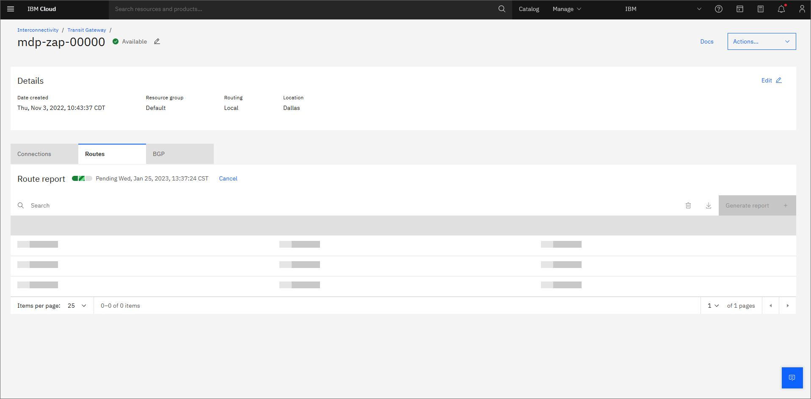
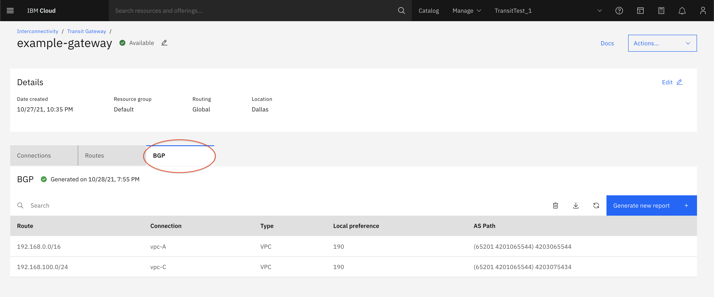
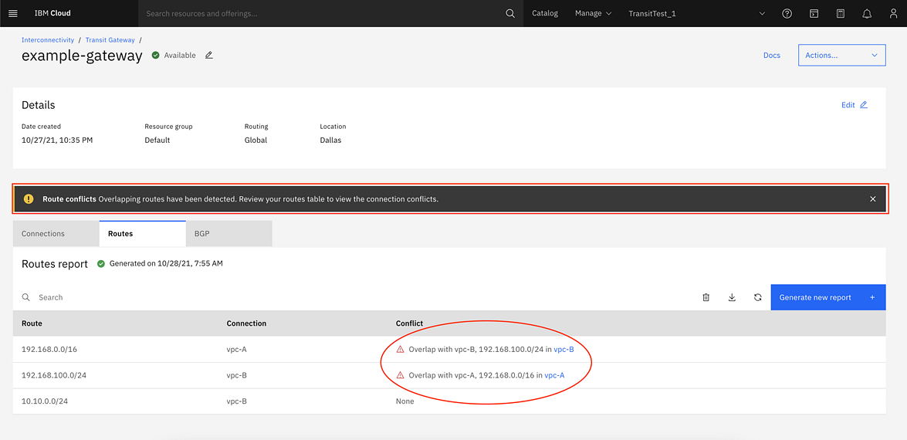
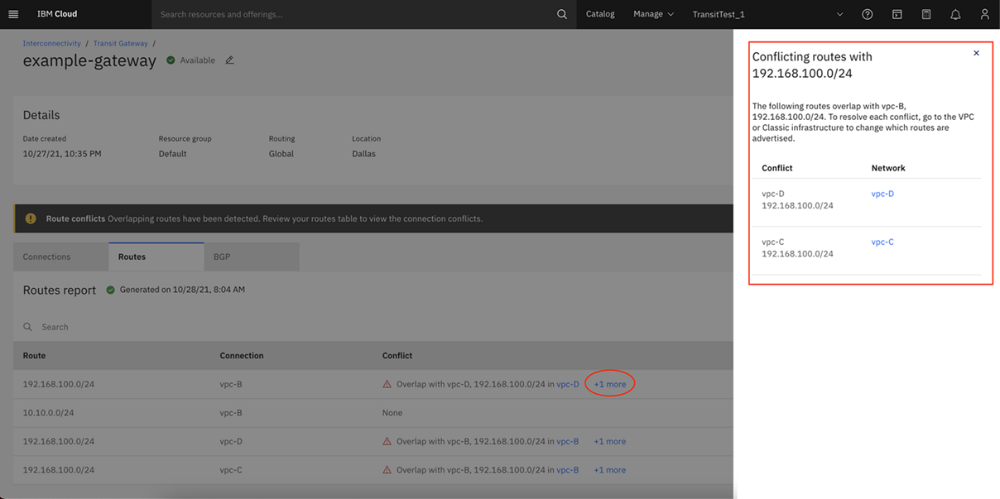

---

copyright:
  years: 2021
lastupdated: "2021-11-15"

keywords: route, report

subcollection: transit-gateway

---

{{site.data.keyword.attribute-definition-list}}

# Generating a transit gateway route report
{: #route-reports}

You can request a report of all routes known to a transit gateway and each of its connections. The report shows:

* Border Gateway Protocol (BGP) information associated with these routes
* Which connections supply which routes
* Overlapping routes

Overlapping routes are a common issue when configuring a transit gateway. If the routes from two or more connections overlap, traffic might not be routed properly. 
{: note}
 
## Generating and viewing a route report by using the UI
{: #generate-route-report-ui}
{: ui}

A route report generates data for both the **Routes** and **BGP** tables in the respective views. Both of these tables allow you to generate, delete, and download the same report.
{: note}

To generate a route report by using the UI, follow these steps:

1. From your browser, open the [{{site.data.keyword.cloud_notm}} console](https://cloud.ibm.com){: external} and log in to your account.
1. Select the Menu icon  from the upper left, then click **Interconnectivity**.
1. Click **Transit Gateway** from the left navigation pane to show the Transit Gateway page.

   {: caption="View your transit gateways" caption-side="bottom"}
   
1. From the transit gateway page, select the gateway that you want to generate the report for. 
1. From the **Routes** or **BGP** tab, click the **Generate new report** button. The route report begins building, and might take a few minutes to generate depending on the complexity of the gateway.

   {: caption="Generating a route report" caption-side="bottom"}

After the report generates, information is displayed in the **Routes** and **BGP** views.

### BGP
{: #route-bgp}

You can use the BGP table to see the **Local preference** and **AS Path** for a route. 

   {: caption="View BGP route information" caption-side="bottom"}

### Route conflicts
{: #route-conflicts}

Conflicting routes show in the **Conflict** column of the **Routes** view. Conflicts can cause routing error that the gateway/connection owner must resolve. For example, in the following image, `vpc-A` and `vpc-B` have conflicts with the overlapping route `192.168.100.0`. 

   {: caption="Display route report" caption-side="bottom"}

If there are multiple conflicts, click the link to open a side panel with more information.

   {: caption="Multiple route conflicts" caption-side="bottom"}
  
## Generating and viewing a route report by using the CLI
{: #generate-route-report-cli}
{: cli}

To generate and view a route report by using the CLI, run the following command:

```sh
ibmcloud tg route-report-create|rrc GATEWAY_ID [--output json] [-h, --help]
``` 

Where:

* **GATEWAY_ID** is the ID of the gateway to list route reports for.
* **--output json** formats the output in JSON.
* **--help | -h** gets help on this command. 

For example, to create a route report for a gateway:

```sh
ibmcloud tg rrc $gateway
```
{: codeblock}

## Generating and viewing a route report by using the API
{: #generate-route-report-api}
{: api}

To generate and view a route report using the API, follow these steps:

1. Set up your [API environment](/docs/transit-gateway?topic=transit-gateway-set-up-environment) with the right variables.
1. Store any additional variables to be used in the API commands, for example:

   ```sh
   transit_gateway="11111111-b540-4766-a196-14368f328eb2"
   ```

1. Request report creation:

   ```sh
   curl -X POST "$transit_api_endpoint/v1/transit_gateways/$transit_gateway/route_reports?version=$api_version" -H "Authorization: $iam_token"
   ```
 
   For the rest of the calls, you'll need to know the ID of the newly created report. Save the ID in a variable, for example:

   ```sh
   route_report="22222222-c540-4766-a196-14368f328eb2"
   ```

   To verify that the variable was saved, run `echo $route_report` and make sure the response is not empty.

1. Wait for the report to become active, then you can view its details:

   ```sh
   curl -X GET "$transit_api_endpoint/v1/transit_gateways/$transit_gateway/route_reports/$route_report?version=$api_version" -H "Authorization: $iam_token"
   ```

## Route report considerations
{: #route-report-considerations}

Consider the following issues when working with route reports:

* If a connection exposes a route of `0.0.0.0/0`, that route is ignored when computing overlapping prefixes.
* Some connection types have routes that are not advertised to the transit gateway, such as Direct Link local routes. These routes are not contained in the route report.
* Only one report per gateway is available at any time. If you generate a new report, the old report is deleted. 
* Older route reports might be inaccurate after you add or remove a connection. As a result, if you update routes within those connections, you should generate a new route report. 
