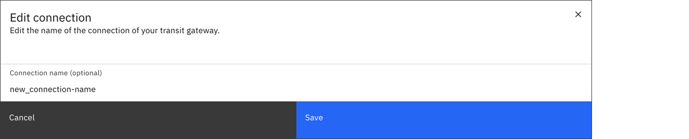

---

copyright:
  years: 2020, 2021
lastupdated: "2021-06-17"

keywords: editing, managing, manage, edit, add, connection

subcollection: transit-gateway

---

{:shortdesc: .shortdesc}
{:new_window: target="_blank"}
{:codeblock: .codeblock}
{:pre: .pre}
{:screen: .screen}
{:tip: .tip}
{:note: .note}
{:important: .important}
{:download: .download}
{:external: target="_blank" .external}
{:term: .term}

# Editing a connection
{: #editing-connections}

To edit a connection to a transit gateway, follow these steps:

1. From your browser, open the [{{site.data.keyword.cloud_notm}} console](https://cloud.ibm.com){:external} and log in to your account.
1. Select the Menu icon  from the upper left, then click **Interconnectivity**.
1. Click **Transit Gateway** from the left navigation pane.
1. Click the name of the transit gateway where you want to edit a connection.

  If you are in the expanded view, click **View details**.
  {: tip}

1. From the Connections page, click the Options menu icon  next to the connection that you want to edit and select **Edit**.

   From here, you can change the name of the selected network connection.

   
