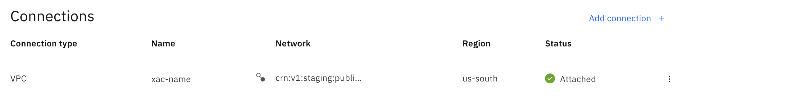
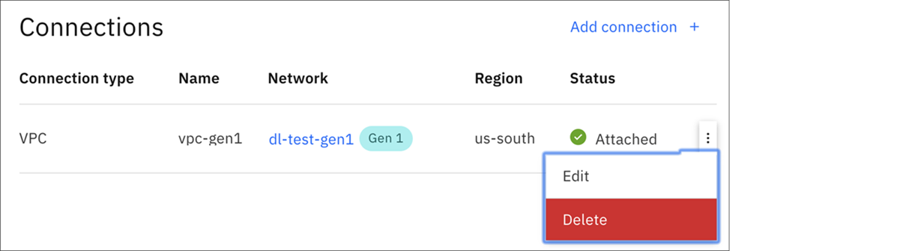

---

copyright:
  years: 2020
lastupdated: "2020-07-20"

keywords: transit, gateway, editing

subcollection: transit-gateway

---

{:shortdesc: .shortdesc}
{:new_window: target="_blank"}
{:codeblock: .codeblock}
{:pre: .pre}
{:screen: .screen}
{:tip: .tip}
{:note: .note}
{:important: .important}
{:download: .download}
{:external: target="_blank" .external}
{:term: .term}

# Managing transit gateways
{: #edit-gateway}

You can add, edit, or delete connections and edit your gateways from your {{site.data.keyword.tg_full}} using the {{site.data.keyword.cloud_notm}} console.
{: shortdesc}

## Adding a connection
{: #adding-connections}

To add a connection to a transit gateway, perform the following procedure:
1. From your browser, open the [{{site.data.keyword.cloud_notm}} console](https://cloud.ibm.com){:external} and log in to your account.
2. Select the Menu icon  from the upper left, then click **Interconnectivity**.
3. Click **Transit Gateway** from the left navigation pane.
4. Click the name of the transit gateway where you want to add a connection.

  If you are in the expanded view, click **View details**.
  {: tip}

5. Click **Add connection**.

   You can now choose and configure the specific network connections that you want to add to your transit gateway.

   

## Adding a cross-account connection (VPC only)
{: #adding-cross-account-connections}
You can request connections to networks in other {{site.data.keyword.cloud_notm}} accounts.

  Only 10 pending requests are allowed per gateway. To create more requests, you can cancel the pending connection request, or wait for it to be approved. Connection requests expire if not approved within 72 hours. 
  {: tip}
  
  Be aware that after you connect a transit gateway to a network in another account, all resources connected to that transit gateway are accessible from the other network. Make sure that this is a trusted account. Use of [security controls](/docs/vpc?topic=vpc-security-in-your-vpc) such as ACLs, security groups, or other network services to control traffic flow are highly recommended.
  {: important}

Follow these steps to connect networks owned by different accounts:

1. From your browser, open the [{{site.data.keyword.cloud_notm}} console](https://cloud.ibm.com){:external} and log in to your account.
2. Select the Menu icon  from the upper left, then click **Interconnectivity**.
3. Click the name of the transit gateway where you want to add a connection and click **Add connection**.
4. In the Add connection window, select **Request connection to a network in another account**.
5. Type the VPC CRN of the cross-account network.
  
  To get the CRN of a VPC, from the {{site.data.keyword.cloud_notm}} console select the Menu icon  from the upper left, and then click **Resource list**. Expand **VPC Infrastructure** to list your VPCs. Select a VPC and click **Status** to view its details. Copy the CRN and paste it into the Add connection window.
  {: tip}

4. Type the name of the network connection, then click **Add**.

   

   The network connection now shows the **Pending** approval status in the gateway account.
   
   The network (VPC) owner's account then receives a notification of the request. If the network (VPC) owner rejects the cross-account connection, no connectivity is established and the connection shows a status of **Rejected**. You can delete this connection at that point, if you wish. If the cross-account connection is not explicitly approved, it expires after 72 hours. 

   Connection requests can be resubmitted if they expire or are rejected.
   {: note}

5. A user with the [necessary IAM permissions](/docs/transit-gateway?topic=transit-gateway-iam#iam) in the network (VPC) owner's account can see the gateway and the details of all other connections attached to it in **View only** mode. From the network (VPC) owner's account, go to the Transit Gateway page and click the gateway name in the table.
6. In the Connections section, see **Action required** to view the incoming network connection request. A user with the [necessary additional IAM permissions](/docs/transit-gateway?topic=transit-gateway-iam#iam) can then click **Approve** to approve the request. 

  After the network (VPC) owner's account ensures that the connection request is from a legitimate source and approves it, the system establishes routes to and from all other networks connected to the same transit gateway. Use of [Network ACLs and/or Security Groups](/docs/vpc?topic=vpc-security-in-your-vpc#security-in-your-vpc) within VPCs that are accessible across accounts are highly recommended to control the network traffic flows. You can unilaterally detach cross-account connections by either account through users who have the appropriate permissions.
  {: important}

  

  Confirm by clicking **Approve**.

  

  The status of the network connection indicates **Attaching**.

7. When you change back to the original account, the status of the connection changes to **Attached**, indicating that the network request was approved.

  

  The gateway account owner (or the network account owner) can delete the connection. If the network owner deletes the connection, the gateway owner sees the connection status as **Detached**. 
  {: note}

## Editing a connection
{: #editing-connections}

To edit a connection to a transit gateway, perform the following procedure:
1. From your browser, open the [{{site.data.keyword.cloud_notm}} console](https://cloud.ibm.com){:external} and log in to your account.
2. Select the Menu icon  from the upper left, then click **Interconnectivity**.
3. Click **Transit Gateway** from the left navigation pane.
4. Click the name of the transit gateway where you want to edit a connection.

  If you are in the expanded view, click **View details**.
  {: tip}

5. From the Connections page, click the Options menu icon  next to the connection you want to edit and select **Edit**.

   From here you can change the name of the selected network connection.

   

## Deleting a connection
{: #deleting-connections}

To delete a connection from a transit gateway, perform the following procedure:
1. From your browser, open the [{{site.data.keyword.cloud_notm}} console](https://cloud.ibm.com){:external} and log in to your account.
2. Select the Menu icon  from the upper left, then click **Interconnectivity**.
3. Click **Transit Gateway** from the left navigation pane.
4. Click the name of the transit gateway where you want to delete a connection.

  If you are in the expanded view, click **View details**.
  {: tip}

5. From the Connections page, click the Options menu icon  next to the connection you want to delete and select **Delete**.

   

## Changing your configuration
{: #change-configuration}

To change your transit gateway configuration, perform the following procedure:
1. From your browser, open the [{{site.data.keyword.cloud_notm}} console](https://cloud.ibm.com){:external} and log in to your account.
2. Select the Menu icon  from the upper left, then click **Interconnectivity**.
3. Click **Transit Gateway** from the left navigation pane.
4. Click the name of the transit gateway you want to edit.

  If you are in the expanded view, click **View details**.
  {: tip}

5. Click **Edit**.

   From here, you can change the gateway's name and its routing type (Local or Global).

   To change a transit gateway's routing type from Global to Local, you must delete any connections that are not local to the transit gateway's location.
{: tip}

   When changing from Local to Global routing for a given transit gateway, you will be charged for all associated connection traffic.
{: important}

   
