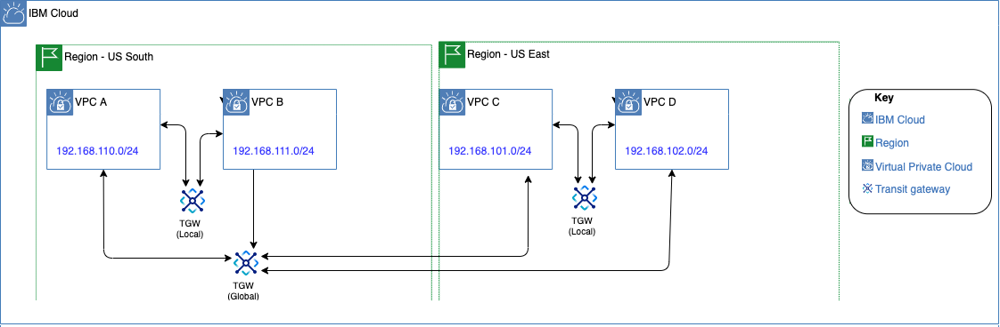

---

copyright:
  years: 2020, 2023
lastupdated: "2023-10-27"

keywords: help, tips, connections, provision

subcollection: transit-gateway

---

{{site.data.keyword.attribute-definition-list}}

# Planning for IBM Cloud Transit Gateway
{: #helpful-tips}

Make sure that you review the following considerations before ordering your {{site.data.keyword.tg_full}}.
{: shortdesc}

## General considerations
{: #general-considerations}

All prefixes of a VPC and all subnets of a classic network will connect to the transit gateway, so it's important that they do not overlap. When creating VPCs that are intended to connect to a transit gateway, make sure to create the VPCs with non-overlapping VPC prefixes.
{: important}

* {{site.data.keyword.tg_full_notm}} supports provisioning transit gateways in the regions listed in [IBM Cloud Transit Gateway locations](/docs/transit-gateway?topic=transit-gateway-tg-locations).
* Create your transit gateway in a location that makes sense for your workload. For example, if you are connecting two VPCs in the `us-south` (Dallas) region and one VPC in the `eu-de` (Frankfurt) region, creating your gateway in `us-south` region would be the most efficient for your workload.
* You cannot connect a [classic access VPC](/docs/vpc?topic=vpc-setting-up-access-to-classic-infrastructure) directly to a transit gateway. To connect the classic resources, use the {{site.data.keyword.cloud_notm}} classic infrastructure connection, and then all the resources in your classic access VPC are automatically connected.
*  A transit gateway requires at least two connections before network traffic can flow over the transit gateway. Transit gateways that have less than two connections for 45 days or more are subject to be reclaimed (suspended, then deleted after 30 days).
* You can connect a VPC, Direct Link, or classic infrastructure to multiple local gateways and a single global gateway.
* Transit gateways and their connections can take several minutes after provisioning before they are available.
* Be descriptive when naming your transit gateway connections. When connecting to resources across accounts, you must specify a connection name. When connecting to resources in the same account as the transit gateway, the VPC name or the word 'classic' is the default selection and can be modified.
* {{site.data.keyword.tg_full_notm}} is a multi-tenant application, where a single instance of the software, and its supporting infrastructure, serves multiple customers. As a result, monitoring your bandwidth use is important. If you use too much bandwidth, your transit gateway instance may be suspended. If you suspect this is the case, check the transit gateway instance connection status to see if it is in a `Suspended` state. If so, [contact support](/docs/transit-gateway?topic=transit-gateway-getting-help-and-support) to reinstate it.
* The following ASNs are blocked on Transit Gateway Generic Routing Encapsulation (GRE) and Direct Link connections. Avoid using these ASNs on appliances so that they are not included on the advertised routes in the AS path. Having these ASNs included prevent networks from working properly.

   `0`, `13884`, `36351`, `64512`, `64513`, `65100`, `65200`–‍`65234`, `65402‍`–‍`65433`, `65500`, and `4201065000‍`–‍`4201065999`

## Pricing considerations
{: #pricing-considerations}

The [IBM Cloud cost estimator](/cloud/cloud-calculator?mhsrc=ibmsearch_a&mhq=cost%20estimator), located on the Transit Gateway provisioning page, cannot interpret network connection types. To get a reliable cost estimate, you must input the estimated number of transit gateways and connections. Keep in mind that if you create a redundant GRE, each tunnel is an individual connection that counts against your [connection limit](/docs/transit-gateway?topic=transit-gateway-helpful-tips#service-limits).

## Direct Link connection consideration
{: #dl_considerations}

You can create Direct Link connections to a transit gateway to allow on-premises networks to connect to other networks in {{site.data.keyword.cloud_notm}}. After the direct link connects to the transit gateway, the on-premises network receives access to all other transit gateway connections. Likewise, all other networks connected to the transit gateway have access to the on-premises network. Direct Link connections follow the same process for physical or virtual cross connections as the standard Direct Link offering. After the connection is deleted from a transit gateway, the transit gateway operates as if it was never connected to a direct link.

The same network subnet considerations for transit gateway connections also apply to Direct Link connections. To ensure successful connectivity, do not use prefixes in your Direct Link connected network that overlap with other connections.
{: important}

## {{site.data.keyword.powerSys_notm}} connection considerations
{: #power-considerations}

You can connect a {{site.data.keyword.powerSys_notm}} instance to a transit gateway. This allows you to directly attach the {{site.data.keyword.powerSys_notm}} to a downstream transit gateway. After the {{site.data.keyword.powerSys_notm}} is connected to the transit gateway, your {{site.data.keyword.powerSys_notm}} service instance then has have access to all downstream transit gateway resources and services. Likewise, all downstream networks connected to the transit gateway will have access to the {{site.data.keyword.powerSys_notm}} instance.

{{site.data.keyword.powerSys_notm}} connections can use Local or Global routing. However, only {{site.data.keyword.powerSys_notm}} instances in the same region as the transit gateway can use local routing. Also, a {{site.data.keyword.powerSys_notm}} instance can be connected to multiple transit gateways with local routing, but only one transit gateway with global routing. Downstream services will honor route preference based on the transit gateway type.

The same network subnet considerations for transit gateway connections also apply to {{site.data.keyword.powerSys_notm}} connections. To ensure successful connectivity, do not use prefixes in your {{site.data.keyword.powerSys_notm}} instance that overlap with other connections. Note that Transit Gateway provides prefix filtering to limit the prefixes being exposed, as well as a routing table report to see any overlaps after the connection is created.
{: important}

## VPC considerations
{: #vpc-connection-consideration}

* {{site.data.keyword.cloud_notm}} VPC permits the use of [RFC-1918](https://datatracker.ietf.org/doc/html/rfc1918){: external} and IANA-registered IPv4 address space, privately within your VPC, with some exceptions in the IANA special-purpose ranges, and select ranges assigned to {{site.data.keyword.cloud_notm}} services. When using IANA-registered ranges within your enterprise, and within VPCs in conjunction with {{site.data.keyword.cloud_notm}} Transit Gateway, custom routes must be installed in each zone. For more information, see [Routing considerations for IANA-registered IP assignments](/docs/vpc?topic=vpc-interconnectivity#routing-considerations-iana).

* You can create a single transit gateway or multiple transit gateways to interconnect more than one IBM Cloud VPCs. You can also connect your IBM Cloud classic infrastructure to a transit gateway to provide seamless communication with classic infrastructure resources. For more information, refer to [Interconnecting VPCs](/docs/vpc?topic=vpc-interconnectivity&interface=cli#interconnecting-vpcs).

## Routing considerations
{: #routing-considerations}

* All connections to a transit gateway are connected to each other, so carefully consider all resources that you want to interconnect before deciding whether local or global routing is right for each gateway.

   Traffic from either routing option does not leave the private IBM Cloud network and is optimized for performance.
   {: note}

* If you plan to use your gateway to connect VPCs in the same multi-zone region ([MZR](/docs/overview?topic=overview-locations#table-mzr)), use local routing to provide connectivity to all accessible resources within the same MZR; for example, `us-south` (Dallas).

   {: caption="Figure 1. Simple local routing example" caption-side="bottom"}

* If you plan to use your transit gateways to connect VPCs locally and between different [MZRs](/docs/overview?topic=overview-locations#table-mzr), use local gateways for VPCs in the same MZR, and a global gateway for VPCs across MZRs. You can use the example that follows a Highly Available (HA) scenario as well. All data in VPCs A and B can be replicated to VPCs C and D. If there is an issue in the US South region, connections reroute to US East.

   {: caption="Figure 2. Combining local and global routing example" caption-side="bottom"}

   Regardless of the routing type specified, {{site.data.keyword.tg_full_notm}} can connect to classic infrastructure networks located in any MZR. To achieve this, simply add the classic connection to your transit gateway.
   {: important}

* You can edit a gateway's routing type after it is provisioned. However, to change the routing type from global to local, you must first remove any global connections (that is, connections to resources that are not in the same location as the gateway). Note that connections to the IBM Cloud classic infrastructure are always considered local.

* When changing from Local to Global routing, you will be charged for all associated global connections. There is no impact to the network traffic when the routing type is changed.

{{site.data.content.reuse-route-report-considerations}}

## Service limits
{: #service-limits}

Keep in mind the following service limits while using IBM Cloud Transit Gateway.

| Service limit |  Default |
|---------------------------|------|
| Number of transit gateways | 10 gateways per account, 5 gateways per region |
| Number of connections per transit gateway |  * 10 IBM Cloud VPC connections  \n * 5 IBM Cloud classic connections  \n * 5 IBM Cloud Direct Link connections  \n * 5 {{site.data.keyword.powerSys_notm}} connections |
| Number of prefixes per connection | * 15 prefixes for VPC connections  \n * 120 prefixes for classic connections  \n * 120 prefixes for GRE connections  \n * 120 prefixes for Direct Link connections  \n * 120 prefixes for {{site.data.keyword.powerSys_notm}} connections |
| Number of connections with prefix filters | 2 connections with prefix filters per gateway|
| Number of prefix filters per connection | 10 prefix filters per connection|
| Number of GRE tunnels per transit gateway | 12 GRE tunnels per gateway|
| Number of unique base networks targeted by unbound GRE tunnels per transit gateway | 5 unique base networks targeted by unbound GRE tunnels per gateway|
{: caption="Table 1. IBM Cloud Transit Gateway service limits" caption-side="bottom"}

You can open an [IBM Support case](/docs/get-support?topic=get-support-using-avatar#using-avatar) if you need your service limits expanded.
{: note}
